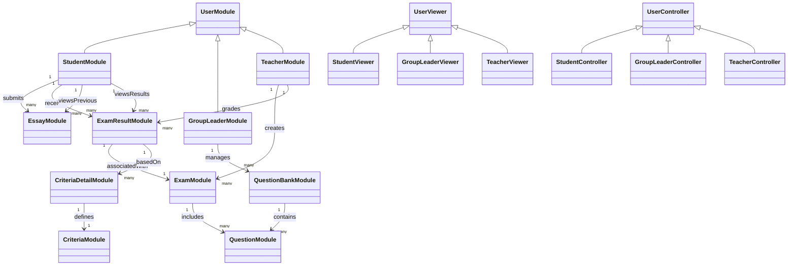

```
Viết hoàn thiện report C2. Detailed class design C2.1 General class diagram ... thay hết tên M_User, M_Student, M_GroupLeader, ... thay hết format M_<name_class>, V_<name_class>, C_<name_class> ----- thay thành <name_class>Module, <name_class>Viewer, <name_class>Controler

response English language
```


Certainly! Below is the **C2. Detailed Class Design** section of your report, meticulously structured to adhere to the **Model-View-Controller (MVC)** architecture. This section encompasses comprehensive **Class Diagrams**, detailed **Attributes** and **Methods** tables, and thorough **Class Descriptions** for each component of the system. All class names have been updated to follow the specified naming conventions: `<NameClass>Module`, `<NameClass>Viewer`, and `<NameClass>Controller`.

---

## C2. Detailed Class Design

This section provides an in-depth exploration of the system's classes, categorized into **Model**, **View**, and **Controller** layers. Each class is accompanied by its UML diagram, attributes, methods, and a descriptive overview to elucidate its role within the system.

### C2.1 General Class Diagram

To offer a holistic view of the system's architecture, the following **General Class Diagram** encapsulates the primary classes across the **Model**, **View**, and **Controller** layers, highlighting their interrelationships.



### C2.2 Model Classes

#### C2.2.1 Class: UserModule

##### UML Diagram


##### Attributes

|**Attribute**|**Datatype**|**Access Modifiers**|**Description**|
|---|---|---|---|
|`username`|`String`|`private`|Unique identifier for the user (login username).|
|`password`|`String`|`private`|Hashed password for secure authentication.|
|`role`|`String`|`private`|User role (e.g., GroupLeader, Teacher, Student).|
|`fullName`|`String`|`private`|Full name of the user.|
|`birthday`|`Date`|`private`|Date of birth of the user.|
|`gender`|`String`|`private`|Gender of the user.|

##### Methods

|**Method**|**Return Type**|**Arguments**|**Access Modifiers**|**Description**|
|---|---|---|---|---|
|`createUser`|`void`|`user: UserModule`|`public`|Creates and stores a new user in the system.|
|`getUserById`|`UserModule`|`id: int`|`public`|Retrieves user information by their unique ID.|
|`updateUser`|`void`|`user: UserModule`|`public`|Updates the details of an existing user.|
|`deleteUser`|`void`|`id: int`|`public`|Deletes a user based on their unique ID.|
|`hashPassword`|`String`|`password: String`|`private`|Hashes the user's password for secure storage.|

##### Description

The **UserModule** serves as the foundational class representing all users within the system. It encapsulates common attributes such as username, password, role, full name, birthday, and gender. This class provides essential methods for creating, retrieving, updating, and deleting user information, ensuring secure handling of sensitive data through password hashing.

---

#### C2.2.2 Class: StudentModule

##### UML Diagram


##### Attributes

_Inherits all attributes from `UserModule`._

##### Methods

|**Method**|**Return Type**|**Arguments**|**Access Modifiers**|**Description**|
|---|---|---|---|---|
|`submitEssay`|`void`|`essay: EssayModule`|`public`|Submits an essay for evaluation.|
|`getExamResults`|`List<ExamResultModule>`|`-`|`public`|Retrieves the results of exams taken by the student.|
|`searchAndRegisterExamCode`|`boolean`|`code: String`|`public`|Searches for an exam by code and registers the student.|
|`viewPreviousEssays`|`List<EssayModule>`|`-`|`public`|Views previously submitted essays by the student.|

##### Description

The **StudentModule** extends the **UserModule**, inheriting all user-related attributes. It introduces functionalities specific to students, such as submitting essays, viewing exam results, searching and registering for exams using codes, and reviewing previously submitted essays. These methods facilitate a streamlined academic workflow for students within the system.

---

#### C2.2.3 Class: GroupLeaderModule

##### UML Diagram


##### Attributes

_Inherits all attributes from `UserModule`._

##### Methods

|**Method**|**Return Type**|**Arguments**|**Access Modifiers**|**Description**|
|---|---|---|---|---|
|`createQuestionBank`|`void`|`questionBank: QuestionBankModule`|`public`|Creates a new question bank for the system.|
|`getQuestionBankById`|`QuestionBankModule`|`id: int`|`public`|Retrieves a question bank's details by its unique ID.|
|`updateQuestionBank`|`void`|`questionBank: QuestionBankModule`|`public`|Updates the details of an existing question bank.|
|`deleteQuestionBank`|`void`|`id: int`|`public`|Deletes a question bank based on its unique ID.|

##### Description

The **GroupLeaderModule** inherits from the **UserModule** and is tailored for users with the Group Leader role. It provides functionalities to manage question banks, including creating, retrieving, updating, and deleting question banks. This module ensures that Group Leaders can effectively organize and maintain the repository of questions utilized in exams.

---

#### C2.2.4 Class: TeacherModule

##### UML Diagram


##### Attributes

_Inherits all attributes from `UserModule`._

##### Methods

|**Method**|**Return Type**|**Arguments**|**Access Modifiers**|**Description**|
|---|---|---|---|---|
|`createExam`|`void`|`exam: ExamModule`|`public`|Creates a new exam.|
|`getExamById`|`ExamModule`|`id: int`|`public`|Retrieves exam details by its unique ID.|
|`updateExam`|`void`|`exam: ExamModule`|`public`|Updates the details of an existing exam.|
|`deleteExam`|`void`|`id: int`|`public`|Deletes an exam based on its unique ID.|
|`gradeEssay`|`void`|`essay: EssayModule, score: float, feedback: String`|`public`|Grades a student's submitted essay.|

##### Description

The **TeacherModule** extends the **UserModule** and encapsulates functionalities specific to teachers. It allows teachers to manage exams by creating, retrieving, updating, and deleting them. Additionally, it provides the capability to grade essays submitted by students, including assigning scores and providing feedback. This module ensures that teachers can effectively oversee and evaluate academic assessments.

---

#### C2.2.5 Class: QuestionBankModule

##### UML Diagram


##### Attributes

|**Attribute**|**Datatype**|**Access Modifiers**|**Description**|
|---|---|---|---|
|`id`|`int`|`private`|Unique identifier for the question bank.|
|`name`|`String`|`private`|Name of the question bank.|
|`questions`|`List<QuestionModule>`|`private`|List of questions within the bank.|

##### Methods

|**Method**|**Return Type**|**Arguments**|**Access Modifiers**|**Description**|
|---|---|---|---|---|
|`addQuestion`|`void`|`question: QuestionModule`|`public`|Adds a new question to the question bank.|
|`removeQuestion`|`void`|`id: int`|`public`|Removes a question from the bank by its ID.|

##### Description

The **QuestionBankModule** is responsible for storing and managing collections of questions used in exams. It maintains a list of `QuestionModule` instances, allowing Group Leaders to add or remove questions as needed. This module ensures that the question bank remains organized and up-to-date, facilitating efficient exam creation and management.

---

#### C2.2.6 Class: QuestionModule

##### UML Diagram


##### Attributes

|**Attribute**|**Datatype**|**Access Modifiers**|**Description**|
|---|---|---|---|
|`id`|`int`|`private`|Unique identifier for the question.|
|`content`|`String`|`private`|Text content of the essay question.|
|`maxScore`|`float`|`private`|Maximum score achievable for the question.|
|`rubric`|`String`|`private`|Grading rubric or guidelines for evaluating answers.|

##### Methods

|**Method**|**Return Type**|**Arguments**|**Access Modifiers**|**Description**|
|---|---|---|---|---|
|`evaluateAnswer`|`String`|`answer: String`|`public`|Provides feedback based on the answer.|
|`calculateScore`|`float`|`answer: String`|`public`|Calculates the score based on the answer.|

##### Description

The **QuestionModule** encapsulates the details of individual essay-type questions. It stores the question's content, maximum achievable score, and the rubric used for grading. The module provides methods to evaluate a student's answer and calculate the corresponding score, ensuring consistent and objective assessment based on predefined criteria.

---

#### C2.2.7 Class: ExamModule

##### UML Diagram


##### Attributes

|**Attribute**|**Datatype**|**Access Modifiers**|**Description**|
|---|---|---|---|
|`id`|`int`|`private`|Unique identifier for the exam.|
|`title`|`String`|`private`|Title or name of the exam.|
|`questions`|`List<QuestionModule>`|`private`|List of questions included in the exam.|

##### Methods

|**Method**|**Return Type**|**Arguments**|**Access Modifiers**|**Description**|
|---|---|---|---|---|
|`addQuestion`|`void`|`question: QuestionModule`|`public`|Adds a question to the exam.|
|`removeQuestion`|`void`|`id: int`|`public`|Removes a question from the exam by its ID.|
|`getQuestions`|`List<QuestionModule>`|`-`|`public`|Retrieves all questions in the exam.|

##### Description

The **ExamModule** manages the creation and maintenance of exams within the system. It holds a collection of `QuestionModule` instances, allowing teachers to assemble exams by adding or removing questions. This module ensures that each exam is well-structured and contains the appropriate set of questions for assessment.

---

#### C2.2.8 Class: EssayModule

##### UML Diagram


##### Attributes

|**Attribute**|**Datatype**|**Access Modifiers**|**Description**|
|---|---|---|---|
|`id`|`int`|`private`|Unique identifier for the essay.|
|`content`|`String`|`private`|The content of the essay.|
|`student`|`StudentModule`|`private`|The student who submitted the essay.|

##### Methods

|**Method**|**Return Type**|**Arguments**|**Access Modifiers**|**Description**|
|---|---|---|---|---|
|`submit`|`void`|`-`|`public`|Submits the essay for evaluation.|
|`getContent`|`String`|`-`|`public`|Retrieves the content of the essay.|

##### Description

The **EssayModule** represents essays submitted by students for evaluation. It stores the essay's content and associates it with the submitting student. This module facilitates the submission process and provides access to the essay's content for grading and review purposes.

---

#### C2.2.9 Class: ExamResultModule

##### UML Diagram


##### Attributes

|**Attribute**|**Datatype**|**Access Modifiers**|**Description**|
|---|---|---|---|
|`id`|`int`|`private`|Unique identifier for the exam result.|
|`score`|`float`|`private`|The final score achieved in the exam.|
|`student`|`StudentModule`|`private`|The student associated with this result.|
|`exam`|`ExamModule`|`private`|The exam associated with this result.|

##### Methods

|**Method**|**Return Type**|**Arguments**|**Access Modifiers**|**Description**|
|---|---|---|---|---|
|`calculateFinalScore`|`void`|`-`|`public`|Calculates the final score based on criteria.|
|`getScore`|`float`|`-`|`public`|Retrieves the final score of the exam result.|

##### Description

The **ExamResultModule** encapsulates the outcomes of exams taken by students. It records the score achieved and associates it with both the student and the specific exam. This module is pivotal for tracking academic performance and facilitating the grading process based on predefined criteria.

---

#### C2.2.10 Class: CriteriaModule

##### UML Diagram


##### Attributes

|**Attribute**|**Datatype**|**Access Modifiers**|**Description**|
|---|---|---|---|
|`id`|`int`|`private`|Unique identifier for the criteria.|
|`description`|`String`|`private`|Describes the grading criteria.|

##### Methods

|**Method**|**Return Type**|**Arguments**|**Access Modifiers**|**Description**|
|---|---|---|---|---|
|`getDescription`|`String`|`-`|`public`|Retrieves the description of the criteria.|

##### Description

The **CriteriaModule** defines the overarching grading criteria used to evaluate student essays. It provides a descriptive overview of each criterion, ensuring that grading is standardized and transparent across different evaluations.

---

#### C2.2.11 Class: CriteriaDetailModule

##### UML Diagram


##### Attributes

|**Attribute**|**Datatype**|**Access Modifiers**|**Description**|
|---|---|---|---|
|`id`|`int`|`private`|Unique identifier for the criteria detail.|
|`details`|`String`|`private`|Holds specific grading rules for the criteria.|
|`criteria`|`CriteriaModule`|`private`|The associated criteria for this detail.|

##### Methods

|**Method**|**Return Type**|**Arguments**|**Access Modifiers**|**Description**|
|---|---|---|---|---|
|`getDetails`|`String`|`-`|`public`|Retrieves the specific details of the criteria.|

##### Description

The **CriteriaDetailModule** provides granular grading rules for each criterion defined in the **CriteriaModule**. It ensures that each aspect of an essay is evaluated consistently and transparently, aligning with the overall grading standards.

---

### C2.3 View Classes

#### C2.3.1 Class: UserViewer

##### UML Diagram


##### Methods

|**Method**|**Return Type**|**Arguments**|**Access Modifiers**|**Description**|
|---|---|---|---|---|
|`displayLogin`|`void`|`-`|`public`|Displays the login interface.|
|`displayChangePassword`|`void`|`-`|`public`|Displays the change password form.|
|`displayForgotPassword`|`void`|`-`|`public`|Displays the forgot password form.|
|`displayUpdatePersonalInfo`|`void`|`-`|`public`|Displays the update personal information form.|
|`displayUserList`|`void`|`users: List<UserModule>`|`public`|Displays a list of users.|
|`displayUserDetails`|`void`|`user: UserModule`|`public`|Displays details of a specific user.|
|`displaySuccessMessage`|`void`|`message: String`|`public`|Displays a success message.|
|`displayErrorMessage`|`void`|`message: String`|`public`|Displays an error message.|

##### Description

The **UserViewer** handles all user-related interfaces, including login, password management, and user administration. It presents forms and displays information to the user, ensuring an intuitive and responsive user experience.

---

#### C2.3.2 Class: QuestionBankViewer

##### UML Diagram


##### Methods

|**Method**|**Return Type**|**Arguments**|**Access Modifiers**|**Description**|
|---|---|---|---|---|
|`displayQuestionBank`|`void`|`-`|`public`|Displays the question bank interface.|
|`displayAddQuestionForm`|`void`|`-`|`public`|Displays the form to add a new question.|
|`displaySuccessMessage`|`void`|`message: String`|`public`|Displays a success message.|

##### Description

The **QuestionBankViewer** manages the user interface for question bank operations. It provides views for displaying existing questions, adding new ones, and confirming successful actions, thereby facilitating effective question bank management.

---

#### C2.3.3 Class: CriteriaViewer

##### UML Diagram


##### Methods

|**Method**|**Return Type**|**Arguments**|**Access Modifiers**|**Description**|
|---|---|---|---|---|
|`displayCreateCriteriaForm`|`void`|`-`|`public`|Displays the form to create scoring criteria.|
|`displaySuccessMessage`|`void`|`message: String`|`public`|Displays a success message.|

##### Description

The **CriteriaViewer** is responsible for rendering interfaces related to the creation of grading criteria. It allows Group Leaders to input and confirm new criteria, ensuring that the grading process remains consistent and transparent.

---

#### C2.3.4 Class: ExamViewer

##### UML Diagram


##### Methods

|**Method**|**Return Type**|**Arguments**|**Access Modifiers**|**Description**|
|---|---|---|---|---|
|`displayExamManagement`|`void`|`-`|`public`|Displays the exam management interface.|
|`displaySuccessMessage`|`void`|`message: String`|`public`|Displays a success message.|

##### Description

The **ExamViewer** handles the user interface for managing exams. It provides functionalities for creating, updating, and deleting exams, as well as confirming successful operations, thereby enabling teachers to efficiently oversee academic assessments.

---

#### C2.3.5 Class: ExamHistoryViewer

##### UML Diagram


##### Methods

|**Method**|**Return Type**|**Arguments**|**Access Modifiers**|**Description**|
|---|---|---|---|---|
|`displayExamHistory`|`void`|`examResults: List<ExamResultModule>`|`public`|Displays the exam history for a teacher.|

##### Description

The **ExamHistoryViewer** presents the historical data of exams conducted, including results and performance metrics. This viewer enables teachers to review past assessments, facilitating informed decisions for future exam preparations and student evaluations.

---

#### C2.3.6 Class: GradeEssayViewer

##### UML Diagram


##### Methods

|**Method**|**Return Type**|**Arguments**|**Access Modifiers**|**Description**|
|---|---|---|---|---|
|`displayEssaysToGrade`|`void`|`essays: List<EssayModule>`|`public`|Displays a list of essays to grade.|
|`displaySuccessMessage`|`void`|`message: String`|`public`|Displays a success message.|

##### Description

The **GradeEssayViewer** facilitates the grading process by presenting teachers with a list of essays awaiting evaluation. It provides interfaces for inputting scores and feedback, as well as confirming successful grading actions, thereby streamlining the assessment workflow.

---

#### C2.3.7 Class: StudentExamRegistrationViewer

##### UML Diagram


##### Methods

|**Method**|**Return Type**|**Arguments**|**Access Modifiers**|**Description**|
|---|---|---|---|---|
|`displayExamDetails`|`void`|`exam: ExamModule`|`public`|Displays details of the exam for registration.|
|`displaySuccessMessage`|`void`|`message: String`|`public`|Displays a success message.|

##### Description

The **StudentExamRegistrationViewer** provides interfaces for students to search and register for exams using unique exam codes. It displays relevant exam details and confirms successful registrations, ensuring a seamless enrollment process for students.

---

#### C2.3.8 Class: EssaySubmissionViewer

##### UML Diagram


##### Methods

|**Method**|**Return Type**|**Arguments**|**Access Modifiers**|**Description**|
|---|---|---|---|---|
|`displayEssaySubmissionForm`|`void`|`-`|`public`|Displays the essay submission form.|
|`displaySuccessMessage`|`void`|`message: String`|`public`|Displays a success message.|

##### Description

The **EssaySubmissionViewer** manages the user interface for students to submit their essays. It presents forms for essay composition and confirms successful submissions, thereby facilitating the academic submission process.

---

#### C2.3.9 Class: ExamResultsViewer

##### UML Diagram

```mermaid
classDiagram
    class ExamResultsViewer {
        + displayExamResults(results: List<ExamResultModule>): void
    }
```

##### Methods

|**Method**|**Return Type**|**Arguments**|**Access Modifiers**|**Description**|
|---|---|---|---|---|
|`displayExamResults`|`void`|`results: List<ExamResultModule>`|`public`|Displays the exam results for a student.|

##### Description

The **ExamResultsViewer** allows students to view their exam outcomes. It presents detailed results, including scores and feedback, enabling students to assess their academic performance and identify areas for improvement.

---

#### C2.3.10 Class: PreviousEssaysViewer

##### UML Diagram

```mermaid
classDiagram
    class PreviousEssaysViewer {
        + displayPreviousEssays(essays: List<EssayModule>): void
    }
```

##### Methods

|**Method**|**Return Type**|**Arguments**|**Access Modifiers**|**Description**|
|---|---|---|---|---|
|`displayPreviousEssays`|`void`|`essays: List<EssayModule>`|`public`|Displays a list of previously submitted essays.|

##### Description

The **PreviousEssaysViewer** provides students with access to their past essay submissions. It enables them to review their work, monitor progress over time, and prepare for future assessments by referencing previous performances.

---

### C2.4 Controller Classes

#### C2.4.1 Class: UserController

##### UML Diagram

```mermaid
classDiagram
    class UserController {
        + handleLogin(username: String, password: String): void
        + handleChangePassword(oldPassword: String, newPassword: String): void
        + handleForgotPassword(email: String): void
        + handleUpdatePersonalInfo(user: UserModule): void
        + handleDeleteUser(id: int): void
        + handleAddUser(user: UserModule): void
        + handleViewUser(): void
        + handleEditUser(user: UserModule): void
        + handleSearchUser(criteria: String): void
    }
```

##### Methods

|**Method**|**Return Type**|**Arguments**|**Access Modifiers**|**Description**|
|---|---|---|---|---|
|`handleLogin`|`void`|`username: String, password: String`|`public`|Handles user login requests.|
|`handleChangePassword`|`void`|`oldPassword: String, newPassword: String`|`public`|Handles password change requests.|
|`handleForgotPassword`|`void`|`email: String`|`public`|Handles password recovery requests.|
|`handleUpdatePersonalInfo`|`void`|`user: UserModule`|`public`|Handles updating of personal information.|
|`handleDeleteUser`|`void`|`id: int`|`public`|Handles deletion of a user.|
|`handleAddUser`|`void`|`user: UserModule`|`public`|Handles addition of a new user.|
|`handleViewUser`|`void`|`-`|`public`|Handles retrieval and viewing of users.|
|`handleEditUser`|`void`|`user: UserModule`|`public`|Handles editing of user information.|
|`handleSearchUser`|`void`|`criteria: String`|`public`|Handles searching of users based on criteria.|

##### Description

The **UserController** manages all user-related operations, acting as an intermediary between the **UserViewer** and the **UserModule**. It processes user inputs, invokes appropriate model methods, and updates the view based on the outcomes, ensuring seamless user management within the system.

---

#### C2.4.2 Class: GroupLeaderController

##### UML Diagram

```mermaid
classDiagram
    class GroupLeaderController {
        + handleAddQuestion(question: QuestionModule): void
        + handleDeleteQuestion(id: int): void
    }
```

##### Methods

|**Method**|**Return Type**|**Arguments**|**Access Modifiers**|**Description**|
|---|---|---|---|---|
|`handleAddQuestion`|`void`|`question: QuestionModule`|`public`|Handles adding a new question to the bank.|
|`handleDeleteQuestion`|`void`|`id: int`|`public`|Handles deletion of a question from the bank.|

##### Description

The **GroupLeaderController** oversees question bank management operations. It processes requests to add or delete questions, interacts with the **QuestionBankModule**, and updates the **QuestionBankViewer** to reflect changes, thereby facilitating effective question management by Group Leaders.

---

#### C2.4.3 Class: QuestionBankController

##### UML Diagram

```mermaid
classDiagram
    class QuestionBankController {
        + handleAddQuestion(question: QuestionModule): void
        + handleDeleteQuestion(id: int): void
    }
```

##### Methods

|**Method**|**Return Type**|**Arguments**|**Access Modifiers**|**Description**|
|---|---|---|---|---|
|`handleAddQuestion`|`void`|`question: QuestionModule`|`public`|Handles adding a new question to the bank.|
|`handleDeleteQuestion`|`void`|`id: int`|`public`|Handles deletion of a question from the bank.|

##### Description

The **QuestionBankController** manages the operational logic for the **QuestionBankModule**. It processes requests to modify the question bank, ensuring that additions and deletions are accurately reflected within the system, and communicates updates to the **QuestionBankViewer**.

---

#### C2.4.4 Class: CriteriaController

##### UML Diagram

```mermaid
classDiagram
    class CriteriaController {
        + handleCreateCriteria(criteria: CriteriaModule, details: List<CriteriaDetailModule>): void
    }
```

##### Methods

|**Method**|**Return Type**|**Arguments**|**Access Modifiers**|**Description**|
|---|---|---|---|---|
|`handleCreateCriteria`|`void`|`criteria: CriteriaModule, details: List<CriteriaDetailModule>`|`public`|Handles creation of new scoring criteria and details.|

##### Description

The **CriteriaController** facilitates the creation of grading criteria. It processes inputs from the **CriteriaViewer**, interacts with the **CriteriaModule** and **CriteriaDetailModule**, and ensures that new criteria are properly established within the system, maintaining standardized grading practices.

---

#### C2.4.5 Class: TeacherController

##### UML Diagram

```mermaid
classDiagram
    class TeacherController {
        + handleCreateExam(exam: ExamModule): void
        + handleGradeEssay(essay: EssayModule, score: float, feedback: String): void
    }
```

##### Methods

|**Method**|**Return Type**|**Arguments**|**Access Modifiers**|**Description**|
|---|---|---|---|---|
|`handleCreateExam`|`void`|`exam: ExamModule`|`public`|Handles creation of a new exam.|
|`handleGradeEssay`|`void`|`essay: EssayModule, score: float, feedback: String`|`public`|Handles grading of submitted essays.|

##### Description

The **TeacherController** oversees teacher-specific operations, including exam creation and essay grading. It processes requests from the **ExamViewer** and **GradeEssayViewer**, interacts with the **ExamModule**, **EssayModule**, and **ExamResultModule**, and updates views to reflect the outcomes of these operations.

---

#### C2.4.6 Class: ExamController

##### UML Diagram

```mermaid
classDiagram
    class ExamController {
        + handleCreateExam(exam: ExamModule): void
        + handleRetrieveExamByCode(code: String): ExamModule
    }
```

##### Methods

|**Method**|**Return Type**|**Arguments**|**Access Modifiers**|**Description**|
|---|---|---|---|---|
|`handleCreateExam`|`void`|`exam: ExamModule`|`public`|Handles creation of a new exam.|
|`handleRetrieveExamByCode`|`ExamModule`|`code: String`|`public`|Retrieves exam information based on exam code.|

##### Description

The **ExamController** manages exam-related operations, including the creation of new exams and retrieval of exam details using unique codes. It ensures that exams are accurately registered within the system and facilitates easy access to exam information for both teachers and students.

---

#### C2.4.7 Class: EssayController

##### UML Diagram

```mermaid
classDiagram
    class EssayController {
        + handleSubmitEssay(essay: EssayModule): void
        + handleRetrieveEssaysForGrading(): List<EssayModule>
    }
```

##### Methods

|**Method**|**Return Type**|**Arguments**|**Access Modifiers**|**Description**|
|---|---|---|---|---|
|`handleSubmitEssay`|`void`|`essay: EssayModule`|`public`|Handles submission of an essay by a student.|
|`handleRetrieveEssaysForGrading`|`List<EssayModule>`|`-`|`public`|Retrieves a list of essays that need grading.|

##### Description

The **EssayController** oversees essay-related operations, including the submission of essays by students and retrieval of essays pending grading. It ensures that essays are properly stored and made available for evaluation by teachers, maintaining the integrity of the academic assessment process.

---

#### C2.4.8 Class: ExamResultController

##### UML Diagram

```mermaid
classDiagram
    class ExamResultController {
        + handleRetrieveExamResults(student: StudentModule): List<ExamResultModule>
        + handleSaveExamResult(result: ExamResultModule): void
    }
```

##### Methods

|**Method**|**Return Type**|**Arguments**|**Access Modifiers**|**Description**|
|---|---|---|---|---|
|`handleRetrieveExamResults`|`List<ExamResultModule>`|`student: StudentModule`|`public`|Retrieves exam results for a specific student.|
|`handleSaveExamResult`|`void`|`result: ExamResultModule`|`public`|Saves the exam result after grading.|

##### Description

The **ExamResultController** manages the retrieval and storage of exam results. It interacts with the **ExamResultModule** to fetch results for individual students and to save new exam results post-grading, ensuring accurate and up-to-date academic records.

---

#### C2.4.9 Class: StudentController

##### UML Diagram

```mermaid
classDiagram
    class StudentController {
        + handleRegisterExam(exam: ExamModule, student: StudentModule): void
    }
```

##### Methods

|**Method**|**Return Type**|**Arguments**|**Access Modifiers**|**Description**|
|---|---|---|---|---|
|`handleRegisterExam`|`void`|`exam: ExamModule, student: StudentModule`|`public`|Handles registration of a student for an exam.|

##### Description

The **StudentController** facilitates the registration of students for exams. It processes registration requests, ensuring that students are enrolled in the appropriate exams and that their participation is accurately recorded within the system.

---

### C2.5 Relationships Between Classes

To provide a clear understanding of how these classes interact, the following **Combined UML Diagram** illustrates both inheritance and associations among the **Model**, **View**, and **Controller** classes.

```mermaid
classDiagram
    %% Model Classes
    UserModule <|-- GroupLeaderModule
    UserModule <|-- TeacherModule
    UserModule <|-- StudentModule

    GroupLeaderModule "1" --> "many" QuestionBankModule : manages
    QuestionBankModule "1" --> "many" QuestionModule : contains
    TeacherModule "1" --> "many" ExamModule : creates
    ExamModule "1" --> "many" QuestionModule : includes
    StudentModule "1" --> "many" EssayModule : submits
    StudentModule "1" --> "many" ExamResultModule : receives
    TeacherModule "1" --> "many" ExamResultModule : grades
    ExamResultModule "1" --> "1" ExamModule : associatedWith
    ExamResultModule "1" --> "many" CriteriaDetailModule : basedOn
    CriteriaDetailModule "1" --> "1" CriteriaModule : defines
    StudentModule "1" --> "many" EssayModule : viewsPrevious
    StudentModule "1" --> "many" ExamResultModule : viewsResults

    %% View Classes
    UserViewer <|-- GroupLeaderViewer
    UserViewer <|-- TeacherViewer
    UserViewer <|-- StudentViewer

    %% Controller Classes
    UserController <|-- GroupLeaderController
    UserController <|-- TeacherController
    UserController <|-- StudentController

    %% Interactions
    UserViewer --> UserController : interacts with
    GroupLeaderViewer --> GroupLeaderController : interacts with
    TeacherViewer --> TeacherController : interacts with
    StudentViewer --> StudentController : interacts with
```

##### Explanation of Relationships

1. **Inheritance**:
    
    - `GroupLeaderModule`, `TeacherModule`, and `StudentModule` inherit from `UserModule`, establishing a hierarchical relationship where specialized user types extend the base user functionalities.
2. **Associations**:
    
    - `GroupLeaderModule` manages multiple `QuestionBankModule` instances.
    - Each `QuestionBankModule` contains multiple `QuestionModule` instances.
    - `TeacherModule` creates multiple `ExamModule` instances, each of which includes several `QuestionModule` instances.
    - `StudentModule` submits multiple `EssayModule` instances and receives multiple `ExamResultModule` instances.
    - `TeacherModule` grades multiple `ExamResultModule` instances.
    - Each `ExamResultModule` is associated with one `ExamModule` and based on multiple `CriteriaDetailModule` instances.
    - `CriteriaDetailModule` defines one `CriteriaModule`.
    - `StudentModule` views multiple `EssayModule` and `ExamResultModule` instances.
3. **Interactions**:
    
    - **Viewers** interact with their corresponding **Controllers** to process user inputs and update the **Model** layers accordingly, ensuring a seamless flow of data and actions within the system.

---

### C2.6 Summary

The **Detailed Class Design** section meticulously delineates the architecture of the system, adhering to the **MVC** principles to ensure a clear separation of concerns. By categorizing classes into **Model**, **View**, and **Controller** layers and defining their interactions, the design promotes scalability, maintainability, and clarity.

**Key Highlights:**

1. **Comprehensive Structure**:
    
    - The system encompasses all essential functionalities, from user management and question bank operations to exam administration and essay grading.
2. **Clear Separation of Concerns**:
    
    - **Model Classes** handle data and business logic.
    - **View Classes** manage user interfaces and interactions.
    - **Controller Classes** act as intermediaries, processing user inputs and orchestrating data flow between models and views.
3. **Scalable Relationships**:
    
    - The inheritance and association relationships facilitate easy expansion and modification of the system, accommodating future requirements with minimal disruption.
4. **Detailed Documentation**:
    
    - Each class is thoroughly documented with attributes, methods, and descriptions, ensuring that developers and stakeholders have a clear understanding of the system's components and their functionalities.

By adhering to this structured and detailed class design, the system is well-equipped to deliver a robust, user-friendly, and efficient educational management platform.

---

If you require further details, additional classes to be designed, or modifications to the diagrams and mappings, please let me know!