```mermaid
classDiagram

    %% TOP LEVEL LAYERED APPLICATION

    class "Layered Application" {

    }

  

    %% PRESENTATION LAYER

    package "Presentation Layer" {

        class AttendExam

        class AutoGrade

        class ChangePassword

        class CreateQuestion

        class CreateTest

        class Login

        class LoginInvalid

        class ManualMark

        class LayoutsPartials

    }

  

    %% BUSINESS LAYER

    package "Business Layer" {

        class UserController

        class StudentController

        class GroupLeaderController

        class TeacherController

        class ExamController

        class ExamResultController

    }

  

    %% DATA LAYER

    package "Data Layer" {

        class User

        class Student

        class GroupLeader

        class Teacher

        class QuestionBank

        class Question

        class Exam

        class ExamResult

        class Essay

    }

  

    %% DEPENDENCIES

    "Presentation Layer" --> "Business Layer" : interacts

    "Business Layer" --> "Data Layer" : uses

    "Presentation Layer" ..> "Data Layer" : indirect dependency
```


Vẽ mãi Layer - Package (No method) with Mermaid and have some bug. 
====> Xài: PlantUML: 

```planuml
@startuml
!define RECTANGLE class
skinparam packageStyle rectangle
skinparam linetype ortho

' MODELS
package "Models" {
    RECTANGLE User
    RECTANGLE GroupLeader
    RECTANGLE Teacher
    RECTANGLE Student
    RECTANGLE QuestionBank
    RECTANGLE Question
    RECTANGLE Exam
    RECTANGLE ExamQuestion
    RECTANGLE Criteria
    RECTANGLE CriteriaDetail
    RECTANGLE ExamResult
    RECTANGLE Essay
}

' CONTROLLERS
package "Controllers" {
    RECTANGLE UserController
    RECTANGLE GroupLeaderController
    RECTANGLE TeacherController
    RECTANGLE StudentController
    RECTANGLE QuestionBankController
    RECTANGLE QuestionController
    RECTANGLE ExamController
    RECTANGLE ExamQuestionController
    RECTANGLE ExamResultController
    RECTANGLE EssayController
}

' VIEWS
package "Views" {
    RECTANGLE AttendExam
    RECTANGLE AutoGrade
    RECTANGLE ChangePassword
    RECTANGLE CreateQuestion
    RECTANGLE CreateTest
    RECTANGLE Login
    RECTANGLE LoginInvalid
    RECTANGLE ManualMark
    RECTANGLE LayoutsPartials
}

' INTERACTIONS: VIEWS --> CONTROLLERS
AttendExam --> StudentController : interacts
AutoGrade --> TeacherController : auto grade
ChangePassword --> UserController : updates password
CreateQuestion --> GroupLeaderController : creates
CreateTest --> TeacherController : manages tests
Login --> UserController : authenticates
LoginInvalid --> UserController : error handling
ManualMark --> TeacherController : manual grading

' INTERACTIONS: CONTROLLERS --> MODELS
UserController --> User : manages
StudentController --> Student : handles
GroupLeaderController --> QuestionBank : updates
TeacherController --> Exam : creates
TeacherController --> ExamResult
@enduml
```


```planuml
@startuml
!define RECTANGLE class
skinparam packageStyle rectangle
skinparam linetype ortho
skinparam ranksep 50
skinparam nodesep 30

' 3 MAIN LAYERS
package "Models Layer" <<Rectangle>> {
    package "User Management" {
        RECTANGLE User
        RECTANGLE Student
        RECTANGLE Teacher
    }
    package "Exam Management" {
        RECTANGLE Exam
        RECTANGLE ExamResult
        RECTANGLE Essay
    }
    package "Question Management" {
        RECTANGLE QuestionBank
        RECTANGLE Question
        RECTANGLE ExamQuestion
    }
}

package "Controllers Layer" <<Rectangle>> {
    package "User Controllers" {
        RECTANGLE UserController
        RECTANGLE StudentController
    }
    package "Exam Controllers" {
        RECTANGLE ExamController
        RECTANGLE ExamResultController
    }
    package "Question Controllers" {
        RECTANGLE QuestionBankController
        RECTANGLE QuestionController
    }
    package "Essay Controllers" {
        RECTANGLE EssayController
    }
}

package "Views Layer" <<Rectangle>> {
    package "User Views" {
        RECTANGLE Login
        RECTANGLE ChangePassword
    }
    package "Exam Views" {
        RECTANGLE AttendExam
        RECTANGLE AutoGrade
    }
    package "Question Views" {
        RECTANGLE CreateQuestion
        RECTANGLE ManualMark
    }
    package "Common Views" {
        RECTANGLE CreateTest
        RECTANGLE LayoutsPartials
    }
}

' INTERACTIONS: BETWEEN LAYERS
Login --> UserController : authenticate
ChangePassword --> UserController : update password
AttendExam --> StudentController : attend exam
AutoGrade --> ExamController : auto-grade exam
CreateQuestion --> QuestionBankController : add question
ManualMark --> ExamResultController : manual grade
CreateTest --> ExamController : create tests
EssayController --> Essay : manages essays
UserController --> User : manages user
StudentController --> Student : manages student
ExamController --> Exam : handles exams
ExamResultController --> ExamResult : processes results
@enduml
```

--- 
vẫn ko được => sau vào: [Untitled Diagram.drawio.png - draw.io](https://app.diagrams.net/) 
-> Arrange -> Insert -> Advanced -> (Mermaid thì sửa được, còn Plant UML thì không)

Cố gắng import vào bằng Mermaid. 
TỰ NHIÊN TRƯỚC ĐÓ PHÂN LAYERS BẰNG MERMAID KHÔNG ĐƯỢC, GIỜ LẠI ĐƯỢC 
```mermaid
flowchart TB

    %% MODELS LAYER

    subgraph ModelsLayer["Models Layer"]

        User[User]

        GroupLeader[GroupLeader]

        Teacher[Teacher]

        Student[Student]

        QuestionBank[QuestionBank]

        Question[Question]

        Exam[Exam]

        ExamQuestion[ExamQuestion]

        Criteria[Criteria]

        CriteriaDetail[CriteriaDetail]

        ExamResult[ExamResult]

        Essay[Essay]

    end

  

    %% CONTROLLERS LAYER

    subgraph ControllersLayer["Controllers Layer"]

        UserController[UserController]

        GroupLeaderController[GroupLeaderController]

        TeacherController[TeacherController]

        StudentController[StudentController]

        QuestionBankController[QuestionBankController]

        QuestionController[QuestionController]

        ExamController[ExamController]

        ExamQuestionController[ExamQuestionController]

        ExamResultController[ExamResultController]

        EssayController[EssayController]

    end

  

    %% VIEWS LAYER

    subgraph ViewsLayer["Views Layer"]

        AttendExam[AttendExam]

        AutoGrade[AutoGrade]

        ChangePassword[ChangePassword]

        CreateQuestion[CreateQuestion]

        CreateTest[CreateTest]

        Login[Login]

        LoginInvalid[LoginInvalid]

        ManualMark[ManualMark]

        LayoutsPartials[LayoutsPartials]

    end

  

    %% INTERACTIONS: VIEWS --> CONTROLLERS

    AttendExam -->|interacts| StudentController

    AutoGrade -->|auto grade| TeacherController

    ChangePassword -->|updates password| UserController

    CreateQuestion -->|creates| GroupLeaderController

    CreateTest -->|manages tests| TeacherController

    Login -->|authenticates| UserController

    LoginInvalid -->|error handling| UserController

    ManualMark -->|manual grading| TeacherController

  

    %% INTERACTIONS: CONTROLLERS --> MODELS

    UserController -->|manages| User

    StudentController -->|handles| Student

    GroupLeaderController -->|updates| QuestionBank

    TeacherController -->|creates| Exam

    TeacherController -->|handles| ExamResult
```

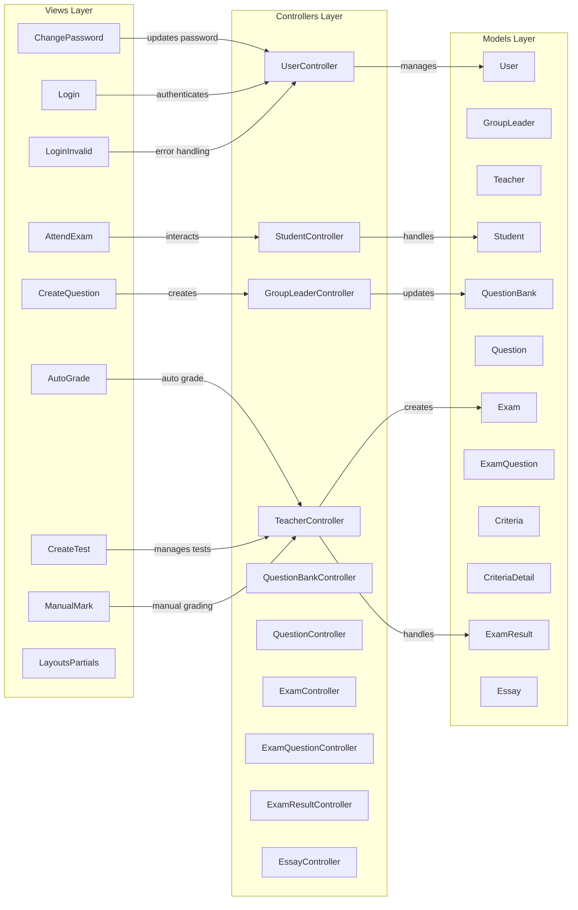


----
Trong UML và các sơ đồ như **Class Diagram**, **Mermaid**, hoặc **PlantUML**, có một số kiểu quan hệ cơ bản để thể hiện các tương tác giữa các lớp, đối tượng hoặc thành phần hệ thống. Dưới đây là danh sách các kiểu quan hệ **phổ biến nhất** và ý nghĩa của chúng:

---

### 1. **Association** (Liên kết)

- **Ý nghĩa**: Mối quan hệ giữa hai lớp cho thấy một lớp có thể biết về lớp kia hoặc tương tác với nhau.
- **Ký hiệu**: Đường thẳng nối giữa hai lớp.
- **Cách thể hiện**:
    - **Mermaid**: `ClassA --> ClassB`
    - **PlantUML**: `ClassA --> ClassB`

---

### 2. **Aggregation** (Tổng hợp)

- **Ý nghĩa**: Thể hiện mối quan hệ **"has-a"** (có một) giữa các lớp, trong đó một lớp chứa các đối tượng của lớp khác nhưng **không phụ thuộc** hoàn toàn.
- **Ký hiệu**: Đường nối với **hình thoi trắng** ở đầu lớp chứa.
- **Cách thể hiện**:
    - **Mermaid**: `ClassA o--> ClassB`
    - **PlantUML**: `ClassA o-- ClassB`

**Ví dụ**: `ClassA o--> ClassB : contains`

---

### 3. **Composition** (Thành phần)

- **Ý nghĩa**: Thể hiện mối quan hệ **"part-of"** (một phần của), trong đó **đời sống** của lớp chứa và lớp được chứa phụ thuộc vào nhau. Nếu lớp chứa bị xóa, các lớp con cũng sẽ bị xóa.
- **Ký hiệu**: Đường nối với **hình thoi đen** ở đầu lớp chứa.
- **Cách thể hiện**:
    - **Mermaid**: `ClassA *--> ClassB`
    - **PlantUML**: `ClassA *-- ClassB`

**Ví dụ**: `ClassA *--> ClassB : part of`

---

### 4. **Inheritance/Generalization** (Kế thừa)

- **Ý nghĩa**: Thể hiện mối quan hệ **"is-a"**, trong đó một lớp con kế thừa các thuộc tính và phương thức từ lớp cha.
- **Ký hiệu**: Đường nối với **mũi tên rỗng** chỉ từ lớp con đến lớp cha.
- **Cách thể hiện**:
    - **Mermaid**: `ClassA <|-- ClassB`
    - **PlantUML**: `ClassA <|-- ClassB`

**Ví dụ**: `ClassB <|-- ClassA : inherits`

---

### 5. **Dependency** (Phụ thuộc)

- **Ý nghĩa**: Thể hiện mối quan hệ **"uses-a"** hoặc phụ thuộc tạm thời. Một lớp phụ thuộc vào lớp khác để thực hiện chức năng.
- **Ký hiệu**: Đường **nét đứt** với mũi tên rỗng.
- **Cách thể hiện**:
    - **Mermaid**: `ClassA ..> ClassB`
    - **PlantUML**: `ClassA ..> ClassB`

**Ví dụ**: `ClassA ..> ClassB : depends`

---

### 6. **Realization** (Hiện thực)

- **Ý nghĩa**: Thể hiện một lớp thực hiện các phương thức được định nghĩa trong một **interface**.
- **Ký hiệu**: Đường **nét đứt** với mũi tên rỗng.
- **Cách thể hiện**:
    - **Mermaid**: `InterfaceA <|.. ClassB`
    - **PlantUML**: `InterfaceA <|.. ClassB`

**Ví dụ**: `InterfaceA <|.. ClassB : implements`

---

### 7. **Directed Association** (Liên kết có hướng)

- **Ý nghĩa**: Giống như Association nhưng có chỉ định hướng cụ thể giữa các lớp.
- **Ký hiệu**: Đường thẳng với **mũi tên đầy** chỉ hướng.
- **Cách thể hiện**:
    - **Mermaid**: `ClassA --> ClassB`
    - **PlantUML**: `ClassA --> ClassB`

---

### Tóm tắt các kiểu quan hệ trong Mermaid:

|**Kiểu Quan Hệ**|**Mermaid Syntax**|**Ý Nghĩa**|
|---|---|---|
|**Association**|`A --> B`|Liên kết|
|**Aggregation**|`A o--> B`|Tổng hợp (has-a)|
|**Composition**|`A *--> B`|Thành phần (part-of)|
|**Inheritance**|`A <|-- B`|
|**Dependency**|`A ..> B`|Phụ thuộc (uses-a)|
|**Realization**|`A <|.. B`|
|**Directed Association**|`A --> B`|Liên kết có hướng|


### **Chiều mũi tên của Aggregation và Composition**

Cả **Aggregation** và **Composition** đều thể hiện mối quan hệ "has-a" giữa các lớp trong sơ đồ UML, nhưng chúng có sự khác biệt về **độ phụ thuộc** của đối tượng.

---

### **1. Aggregation (Tổng hợp)**

- **Chiều mũi tên**: Hình thoi **trắng** nằm ở **đầu lớp chứa** (class parent) và mũi tên chỉ về **lớp thành phần** (class child).
- **Ý nghĩa**:
    - Đối tượng của lớp chứa có thể chứa đối tượng của lớp thành phần.
    - Lớp thành phần **có thể tồn tại độc lập** ngoài lớp chứa.

#### **Ví dụ Aggregation:**

Mermaid:

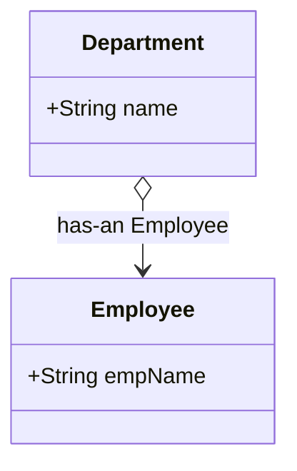

PlantUML:

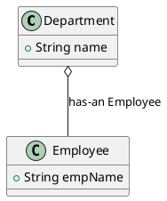

- **Hình ảnh minh họa**:
    - Hình thoi **trắng** ở đầu **Department**.
    - Mũi tên chỉ đến **Employee**.

---

### **2. Composition (Thành phần)**

- **Chiều mũi tên**: Hình thoi **đen** nằm ở **đầu lớp chứa** (class parent) và mũi tên chỉ về **lớp thành phần** (class child).
- **Ý nghĩa**:
    - Lớp thành phần **phụ thuộc hoàn toàn** vào lớp chứa.
    - Nếu lớp chứa bị xóa, các đối tượng lớp thành phần cũng sẽ bị xóa.

#### **Ví dụ Composition**:

Mermaid:

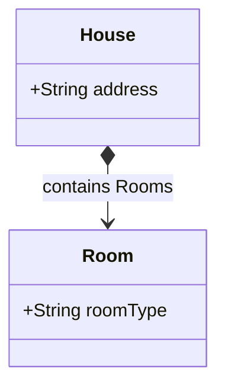

PlantUML:

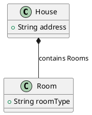

- **Hình ảnh minh họa**:
    - Hình thoi **đen** ở đầu **House**.
    - Mũi tên chỉ đến **Room**.

---

### **So sánh Aggregation và Composition**

|Đặc điểm|Aggregation|Composition|
|---|---|---|
|**Độ phụ thuộc**|Thành phần có thể tồn tại độc lập.|Thành phần phụ thuộc hoàn toàn vào lớp chứa.|
|**Ký hiệu**|Hình thoi **trắng**|Hình thoi **đen**|
|**Ví dụ**|Department o--> Employee|House *--> Room|

---

### **Hình minh họa tổng hợp**:

Mermaid:

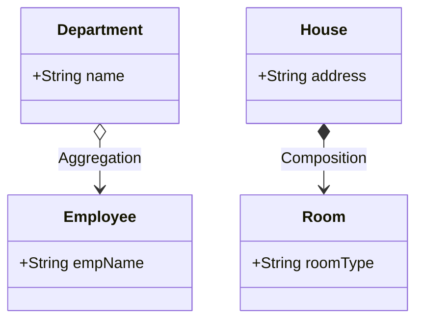

PlantUML:

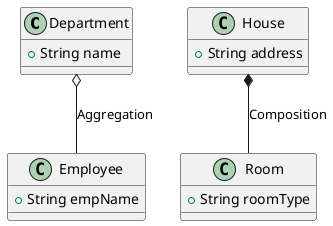

---

Nếu cần thêm hình ảnh minh họa hay ví dụ cụ thể hơn, bạn chỉ cần nói nhé! 😊 🚀

---

Nếu bạn cần thêm ví dụ hoặc cách triển khai cụ thể trong Mermaid, mình sẵn sàng giúp bạn chỉnh sửa mã! 🚀

![[Pasted image 20241218022507.png]]


![[Pasted image 20241218022432.png]]
---
---
```mermaid
classDiagram
    %% Controller Classes
    class userController {
        +handleLogin(username: String, password: String): void
        +handleChangePassword(oldPassword: String, newPassword: String): void
        +handleForgotPassword(email: String): void
        +handleUpdatePersonalInfo(user: User): void
        +handleDeleteUser(id: int): void
        +handleAddUser(user: User): void
        +handleViewUser(): void
        +handleEditUser(user: User): void
        +handleSearchUser(criteria: String): void
    }

    class groupLeaderController {
        +handleAddQuestion(question: Question): void
        +handleDeleteQuestion(id: int): void
    }

    class questionBankController {
        +handleAddQuestion(question: Question): void
        +handleDeleteQuestion(id: int): void
    }

    class criteriaController {
        +handleCreateCriteria(criteria: Criteria, details: List<CriteriaDetail>): void
    }

    class teacherController {
        +handleCreateExam(exam: Exam): void
        +handleGradeEssay(essay: Essay, score: float, feedback: String): void
    }

    class examController {
        +handleCreateExam(exam: Exam): void
        +handleRetrieveExamByCode(code: String): Exam
    }

    class essayController {
        +handleSubmitEssay(essay: Essay): void
        +handleRetrieveEssaysForGrading(): List<Essay>
    }

    class examResultController {
        +handleRetrieveExamResults(student: Student): List<ExamResult>
        +handleSaveExamResult(result: ExamResult): void
    }

    class studentController {
        +handleRegisterExam(exam: Exam, student: Student): void
    }

    %% Relationships
    groupLeaderController --> questionBankController : interactsWith
    teacherController --> examController : manages
    essayController --> examResultController : interactsWith
    studentController --> examController : interactsWith

```

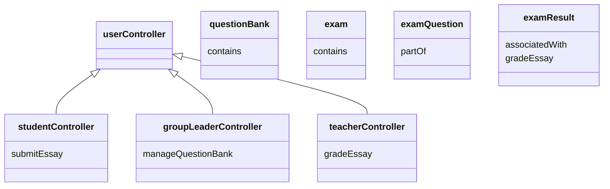


```mermaid
classDiagram

    class attendexam {

        Provides UI for attending exams

    }

    class autograde {

        Interface for automatic essay grading

    }

    class changepassword {

        Password change functionality

    }

    class createquestion {

        View for creating questions

    }

    class createtest {

        Test creation interface

    }

    class login {

        Login interface for users

    }

    class login_invalid {

        Displays error for invalid login

    }

    class manualmark {

        Interface for manual grading

    }
```


----------------
### **Class: attendexam**

#### **Attributes**

|**Attribute**|**Type**|**Access Modifier**|**Description**|
|---|---|---|---|
|`examId`|`String`|`private`|Stores the ID of the exam being attended.|
|`studentId`|`String`|`private`|Stores the ID of the student attending the exam.|

#### **Methods**

|**Method**|**Return Type**|**Arguments**|**Access Modifiers**|**Description**|
|---|---|---|---|---|
|`displayExamInterface`|`void`|`-`|`public`|Displays the exam participation interface.|
|`displaySuccessMessage`|`void`|`message: String`|`public`|Displays a success message.|
|`displayErrorMessage`|`void`|`message: String`|`public`|Displays an error message.|

---

### **Class: autograde**

#### **Attributes**

|**Attribute**|**Type**|**Access Modifier**|**Description**|
|---|---|---|---|
|`grades`|`List<Grade>`|`private`|Stores the grades generated by the autograding process.|

#### **Methods**

|**Method**|**Return Type**|**Arguments**|**Access Modifiers**|**Description**|
|---|---|---|---|---|
|`displayGradeSummary`|`void`|`grades: List<Grade>`|`public`|Displays automatically graded results.|
|`displaySuccessMessage`|`void`|`message: String`|`public`|Displays a success message.|

---

### **Class: changepassword**

#### **Attributes**

|**Attribute**|**Type**|**Access Modifier**|**Description**|
|---|---|---|---|
|`userId`|`String`|`private`|Stores the ID of the user changing their password.|
|`newPassword`|`String`|`private`|Stores the new password entered by the user.|

#### **Methods**

|**Method**|**Return Type**|**Arguments**|**Access Modifiers**|**Description**|
|---|---|---|---|---|
|`displayChangePasswordForm`|`void`|`-`|`public`|Displays the change password form.|
|`displaySuccessMessage`|`void`|`message: String`|`public`|Displays a success message.|
|`displayErrorMessage`|`void`|`message: String`|`public`|Displays an error message.|

---

### **Class: createquestion**

#### **Attributes**

|**Attribute**|**Type**|**Access Modifier**|**Description**|
|---|---|---|---|
|`questionId`|`String`|`private`|Stores the ID of the question being created.|
|`questionDetails`|`String`|`private`|Stores the details of the new question.|

#### **Methods**

|**Method**|**Return Type**|**Arguments**|**Access Modifiers**|**Description**|
|---|---|---|---|---|
|`displayQuestionForm`|`void`|`-`|`public`|Displays the form to add a new question.|
|`displaySuccessMessage`|`void`|`message: String`|`public`|Displays a success message.|

---

### **Class: createtest**

#### **Attributes**

|**Attribute**|**Type**|**Access Modifier**|**Description**|
|---|---|---|---|
|`testId`|`String`|`private`|Stores the ID of the test being created.|
|`testDetails`|`String`|`private`|Stores the details of the new test.|

#### **Methods**

|**Method**|**Return Type**|**Arguments**|**Access Modifiers**|**Description**|
|---|---|---|---|---|
|`displayTestCreationForm`|`void`|`-`|`public`|Displays the test creation interface.|
|`displaySuccessMessage`|`void`|`message: String`|`public`|Displays a success message.|

---

### **Class: login**

#### **Attributes**

|**Attribute**|**Type**|**Access Modifier**|**Description**|
|---|---|---|---|
|`username`|`String`|`private`|Stores the username entered by the user.|
|`password`|`String`|`private`|Stores the password entered by the user.|

#### **Methods**

|**Method**|**Return Type**|**Arguments**|**Access Modifiers**|**Description**|
|---|---|---|---|---|
|`displayLoginForm`|`void`|`-`|`public`|Displays the login interface.|
|`displaySuccessMessage`|`void`|`message: String`|`public`|Displays a success message.|


---

### **Class: login_invalid**

#### **Attributes**

|**Attribute**|**Type**|**Access Modifier**|**Description**|
|---|---|---|---|
|`errorMessage`|`String`|`private`|Stores the error message for invalid login.|
|`errorTimestamp`|`DateTime`|`private`|Stores the timestamp when the error occurred.|

#### **Methods**

|**Method**|**Return Type**|**Arguments**|**Access Modifiers**|**Description**|
|---|---|---|---|---|
|`displayInvalidLoginError`|`void`|`message: String`|`public`|Displays an error message for invalid login.|
|`logErrorDetails`|`void`|`message: String, timestamp: DateTime`|`private`|Logs the error details internally for tracking.|

---

### **Class: manualmark**

#### **Attributes**

|**Attribute**|**Type**|**Access Modifier**|**Description**|
|---|---|---|---|
|`essayList`|`List<Essay>`|`private`|Stores the list of essays for grading.|
|`currentEssay`|`Essay`|`private`|Stores the essay currently being graded.|
|`gradingCriteria`|`String`|`private`|Stores the criteria for manual grading.|

#### **Methods**

|**Method**|**Return Type**|**Arguments**|**Access Modifiers**|**Description**|
|---|---|---|---|---|
|`displayEssaysForGrading`|`void`|`essays: List<Essay>`|`public`|Displays the list of essays to be graded.|
|`displayGradingForm`|`void`|`essay: Essay`|`public`|Displays the grading form for a specific essay.|
|`submitGrade`|`void`|`essayId: String, grade: String`|`public`|Submits the grade for a specific essay.|
|`displaySuccessMessage`|`void`|`message: String`|`public`|Displays a success message after grading.|
|`displayErrorMessage`|`void`|`message: String`|`public`|Displays an error message if grading fails.|

---
