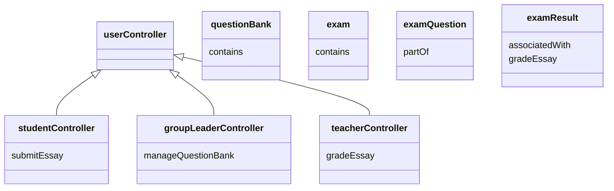

```mermaid
classDiagram
    %% Controller Classes
    class userController {
        +handleLogin(username: String, password: String): void
        +handleChangePassword(oldPassword: String, newPassword: String): void
        +handleForgotPassword(email: String): void
        +handleUpdatePersonalInfo(user: User): void
        +handleDeleteUser(id: int): void
        +handleAddUser(user: User): void
        +handleViewUser(): void
        +handleEditUser(user: User): void
        +handleSearchUser(criteria: String): void
    }

    class groupLeaderController {
        +handleAddQuestion(question: Question): void
        +handleDeleteQuestion(id: int): void
    }

    class questionBankController {
        +handleAddQuestion(question: Question): void
        +handleDeleteQuestion(id: int): void
    }

    class criteriaController {
        +handleCreateCriteria(criteria: Criteria, details: List<CriteriaDetail>): void
    }

    class teacherController {
        +handleCreateExam(exam: Exam): void
        +handleGradeEssay(essay: Essay, score: float, feedback: String): void
    }

    class examController {
        +handleCreateExam(exam: Exam): void
        +handleRetrieveExamByCode(code: String): Exam
    }

    class essayController {
        +handleSubmitEssay(essay: Essay): void
        +handleRetrieveEssaysForGrading(): List<Essay>
    }

    class examResultController {
        +handleRetrieveExamResults(student: Student): List<ExamResult>
        +handleSaveExamResult(result: ExamResult): void
    }

    class studentController {
        +handleRegisterExam(exam: Exam, student: Student): void
    }

    %% Relationships
    groupLeaderController --> questionBankController : interactsWith
    teacherController --> examController : manages
    essayController --> examResultController : interactsWith
    studentController --> examController : interactsWith

```

```mermaid
classDiagram
    userController <|-- studentController
    userController <|-- groupLeaderController
    userController <|-- teacherController

    groupLeaderController : manageQuestionBank
    questionBank : contains
    exam : contains
    examQuestion : partOf
    studentController : submitEssay
    teacherController : gradeEssay
    examResult : associatedWith
    examResult : gradeEssay

```

```mermaid
classDiagram

    class attendexam {

        Provides UI for attending exams

    }

    class autograde {

        Interface for automatic essay grading

    }

    class changepassword {

        Password change functionality

    }

    class createquestion {

        View for creating questions

    }

    class createtest {

        Test creation interface

    }

    class login {

        Login interface for users

    }

    class login_invalid {

        Displays error for invalid login

    }

    class manualmark {

        Interface for manual grading

    }
```