```mermaid
classDiagram

    %% TOP LEVEL LAYERED APPLICATION

    class "Layered Application" {

    }

  

    %% PRESENTATION LAYER

    package "Presentation Layer" {

        class AttendExam

        class AutoGrade

        class ChangePassword

        class CreateQuestion

        class CreateTest

        class Login

        class LoginInvalid

        class ManualMark

        class LayoutsPartials

    }

  

    %% BUSINESS LAYER

    package "Business Layer" {

        class UserController

        class StudentController

        class GroupLeaderController

        class TeacherController

        class ExamController

        class ExamResultController

    }

  

    %% DATA LAYER

    package "Data Layer" {

        class User

        class Student

        class GroupLeader

        class Teacher

        class QuestionBank

        class Question

        class Exam

        class ExamResult

        class Essay

    }

  

    %% DEPENDENCIES

    "Presentation Layer" --> "Business Layer" : interacts

    "Business Layer" --> "Data Layer" : uses

    "Presentation Layer" ..> "Data Layer" : indirect dependency
```


Vẽ mãi Layer - Package (No method) with Mermaid and have some bug. 
====> Xài: PlantUML: 

```planuml
@startuml
!define RECTANGLE class
skinparam packageStyle rectangle
skinparam linetype ortho

' MODELS
package "Models" {
    RECTANGLE User
    RECTANGLE GroupLeader
    RECTANGLE Teacher
    RECTANGLE Student
    RECTANGLE QuestionBank
    RECTANGLE Question
    RECTANGLE Exam
    RECTANGLE ExamQuestion
    RECTANGLE Criteria
    RECTANGLE CriteriaDetail
    RECTANGLE ExamResult
    RECTANGLE Essay
}

' CONTROLLERS
package "Controllers" {
    RECTANGLE UserController
    RECTANGLE GroupLeaderController
    RECTANGLE TeacherController
    RECTANGLE StudentController
    RECTANGLE QuestionBankController
    RECTANGLE QuestionController
    RECTANGLE ExamController
    RECTANGLE ExamQuestionController
    RECTANGLE ExamResultController
    RECTANGLE EssayController
}

' VIEWS
package "Views" {
    RECTANGLE AttendExam
    RECTANGLE AutoGrade
    RECTANGLE ChangePassword
    RECTANGLE CreateQuestion
    RECTANGLE CreateTest
    RECTANGLE Login
    RECTANGLE LoginInvalid
    RECTANGLE ManualMark
    RECTANGLE LayoutsPartials
}

' INTERACTIONS: VIEWS --> CONTROLLERS
AttendExam --> StudentController : interacts
AutoGrade --> TeacherController : auto grade
ChangePassword --> UserController : updates password
CreateQuestion --> GroupLeaderController : creates
CreateTest --> TeacherController : manages tests
Login --> UserController : authenticates
LoginInvalid --> UserController : error handling
ManualMark --> TeacherController : manual grading

' INTERACTIONS: CONTROLLERS --> MODELS
UserController --> User : manages
StudentController --> Student : handles
GroupLeaderController --> QuestionBank : updates
TeacherController --> Exam : creates
TeacherController --> ExamResult
@enduml
```





```mermaid
classDiagram

    class attendexam {

        Provides UI for attending exams

    }

    class autograde {

        Interface for automatic essay grading

    }

    class changepassword {

        Password change functionality

    }

    class createquestion {

        View for creating questions

    }

    class createtest {

        Test creation interface

    }

    class login {

        Login interface for users

    }

    class login_invalid {

        Displays error for invalid login

    }

    class manualmark {

        Interface for manual grading

    }
```

----------------
### **Class: attendexam**

#### **Attributes**

|**Attribute**|**Type**|**Access Modifier**|**Description**|
|---|---|---|---|
|`examId`|`String`|`private`|Stores the ID of the exam being attended.|
|`studentId`|`String`|`private`|Stores the ID of the student attending the exam.|

#### **Methods**

|**Method**|**Return Type**|**Arguments**|**Access Modifiers**|**Description**|
|---|---|---|---|---|
|`displayExamInterface`|`void`|`-`|`public`|Displays the exam participation interface.|
|`displaySuccessMessage`|`void`|`message: String`|`public`|Displays a success message.|
|`displayErrorMessage`|`void`|`message: String`|`public`|Displays an error message.|

---

### **Class: autograde**

#### **Attributes**

|**Attribute**|**Type**|**Access Modifier**|**Description**|
|---|---|---|---|
|`grades`|`List<Grade>`|`private`|Stores the grades generated by the autograding process.|

#### **Methods**

|**Method**|**Return Type**|**Arguments**|**Access Modifiers**|**Description**|
|---|---|---|---|---|
|`displayGradeSummary`|`void`|`grades: List<Grade>`|`public`|Displays automatically graded results.|
|`displaySuccessMessage`|`void`|`message: String`|`public`|Displays a success message.|

---

### **Class: changepassword**

#### **Attributes**

|**Attribute**|**Type**|**Access Modifier**|**Description**|
|---|---|---|---|
|`userId`|`String`|`private`|Stores the ID of the user changing their password.|
|`newPassword`|`String`|`private`|Stores the new password entered by the user.|

#### **Methods**

|**Method**|**Return Type**|**Arguments**|**Access Modifiers**|**Description**|
|---|---|---|---|---|
|`displayChangePasswordForm`|`void`|`-`|`public`|Displays the change password form.|
|`displaySuccessMessage`|`void`|`message: String`|`public`|Displays a success message.|
|`displayErrorMessage`|`void`|`message: String`|`public`|Displays an error message.|

---

### **Class: createquestion**

#### **Attributes**

|**Attribute**|**Type**|**Access Modifier**|**Description**|
|---|---|---|---|
|`questionId`|`String`|`private`|Stores the ID of the question being created.|
|`questionDetails`|`String`|`private`|Stores the details of the new question.|

#### **Methods**

|**Method**|**Return Type**|**Arguments**|**Access Modifiers**|**Description**|
|---|---|---|---|---|
|`displayQuestionForm`|`void`|`-`|`public`|Displays the form to add a new question.|
|`displaySuccessMessage`|`void`|`message: String`|`public`|Displays a success message.|

---

### **Class: createtest**

#### **Attributes**

|**Attribute**|**Type**|**Access Modifier**|**Description**|
|---|---|---|---|
|`testId`|`String`|`private`|Stores the ID of the test being created.|
|`testDetails`|`String`|`private`|Stores the details of the new test.|

#### **Methods**

|**Method**|**Return Type**|**Arguments**|**Access Modifiers**|**Description**|
|---|---|---|---|---|
|`displayTestCreationForm`|`void`|`-`|`public`|Displays the test creation interface.|
|`displaySuccessMessage`|`void`|`message: String`|`public`|Displays a success message.|

---

### **Class: login**

#### **Attributes**

|**Attribute**|**Type**|**Access Modifier**|**Description**|
|---|---|---|---|
|`username`|`String`|`private`|Stores the username entered by the user.|
|`password`|`String`|`private`|Stores the password entered by the user.|

#### **Methods**

|**Method**|**Return Type**|**Arguments**|**Access Modifiers**|**Description**|
|---|---|---|---|---|
|`displayLoginForm`|`void`|`-`|`public`|Displays the login interface.|
|`displaySuccessMessage`|`void`|`message: String`|`public`|Displays a success message.|


---

### **Class: login_invalid**

#### **Attributes**

|**Attribute**|**Type**|**Access Modifier**|**Description**|
|---|---|---|---|
|`errorMessage`|`String`|`private`|Stores the error message for invalid login.|
|`errorTimestamp`|`DateTime`|`private`|Stores the timestamp when the error occurred.|

#### **Methods**

|**Method**|**Return Type**|**Arguments**|**Access Modifiers**|**Description**|
|---|---|---|---|---|
|`displayInvalidLoginError`|`void`|`message: String`|`public`|Displays an error message for invalid login.|
|`logErrorDetails`|`void`|`message: String, timestamp: DateTime`|`private`|Logs the error details internally for tracking.|

---

### **Class: manualmark**

#### **Attributes**

|**Attribute**|**Type**|**Access Modifier**|**Description**|
|---|---|---|---|
|`essayList`|`List<Essay>`|`private`|Stores the list of essays for grading.|
|`currentEssay`|`Essay`|`private`|Stores the essay currently being graded.|
|`gradingCriteria`|`String`|`private`|Stores the criteria for manual grading.|

#### **Methods**

|**Method**|**Return Type**|**Arguments**|**Access Modifiers**|**Description**|
|---|---|---|---|---|
|`displayEssaysForGrading`|`void`|`essays: List<Essay>`|`public`|Displays the list of essays to be graded.|
|`displayGradingForm`|`void`|`essay: Essay`|`public`|Displays the grading form for a specific essay.|
|`submitGrade`|`void`|`essayId: String, grade: String`|`public`|Submits the grade for a specific essay.|
|`displaySuccessMessage`|`void`|`message: String`|`public`|Displays a success message after grading.|
|`displayErrorMessage`|`void`|`message: String`|`public`|Displays an error message if grading fails.|

---
