```mermaid
classDiagram
    %% Controller Classes
    class userController {
        +handleLogin(username: String, password: String): void
        +handleChangePassword(oldPassword: String, newPassword: String): void
        +handleForgotPassword(email: String): void
        +handleUpdatePersonalInfo(user: User): void
        +handleDeleteUser(id: int): void
        +handleAddUser(user: User): void
        +handleViewUser(): void
        +handleEditUser(user: User): void
        +handleSearchUser(criteria: String): void
    }

    class groupLeaderController {
        +handleAddQuestion(question: Question): void
        +handleDeleteQuestion(id: int): void
    }

    class questionBankController {
        +handleAddQuestion(question: Question): void
        +handleDeleteQuestion(id: int): void
    }

    class criteriaController {
        +handleCreateCriteria(criteria: Criteria, details: List<CriteriaDetail>): void
    }

    class teacherController {
        +handleCreateExam(exam: Exam): void
        +handleGradeEssay(essay: Essay, score: float, feedback: String): void
    }

    class examController {
        +handleCreateExam(exam: Exam): void
        +handleRetrieveExamByCode(code: String): Exam
    }

    class essayController {
        +handleSubmitEssay(essay: Essay): void
        +handleRetrieveEssaysForGrading(): List<Essay>
    }

    class examResultController {
        +handleRetrieveExamResults(student: Student): List<ExamResult>
        +handleSaveExamResult(result: ExamResult): void
    }

    class studentController {
        +handleRegisterExam(exam: Exam, student: Student): void
    }

    %% Relationships
    groupLeaderController --> questionBankController : interactsWith
    teacherController --> examController : manages
    essayController --> examResultController : interactsWith
    studentController --> examController : interactsWith

```

```mermaid
    User <|-- Student
    User <|-- GroupLeader
    User <|-- Teacher

    GroupLeader --> QuestionBank : manageQuestionBank
    QuestionBank --> Question : contains
    Exam --> ExamQuestion : contains
    ExamQuestion --> Question : partOf
    Student --> Essay : submitEssay
    Teacher --> ExamResult : gradeEssay
    ExamResult --> ExamResultCriteria : associatedWith
    ExamResult --> Essay : gradeEssay
```