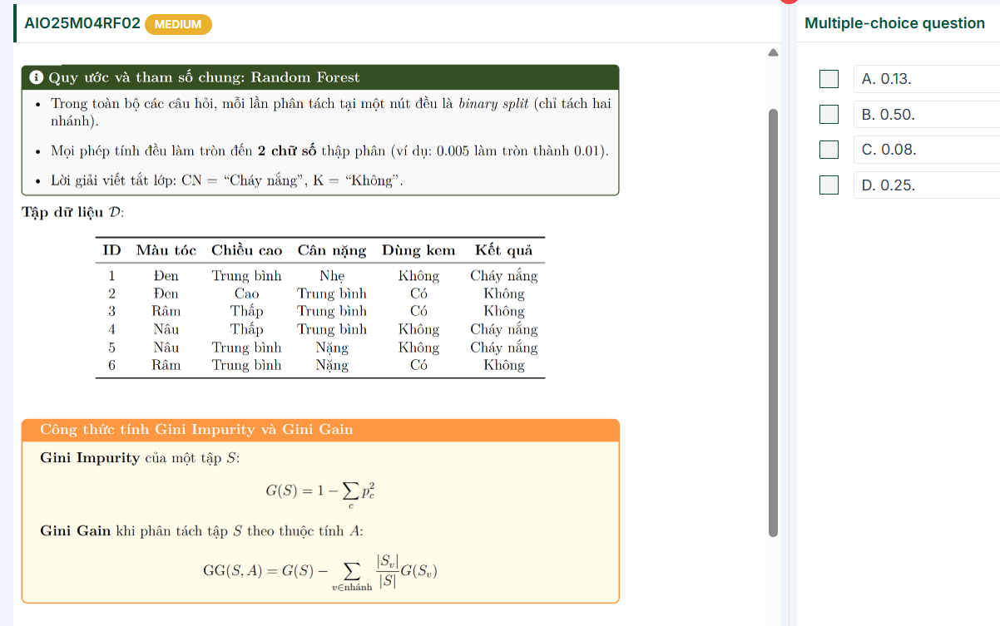
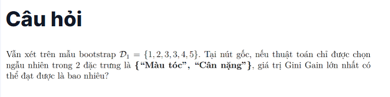
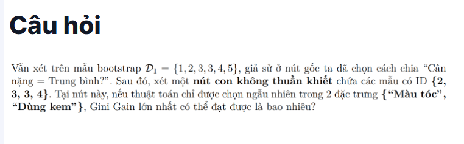
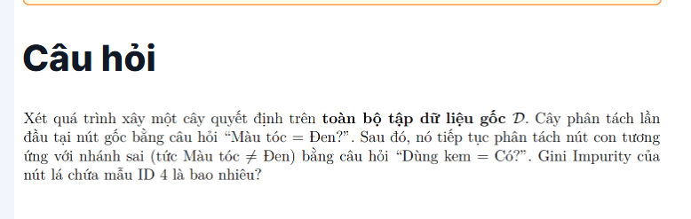
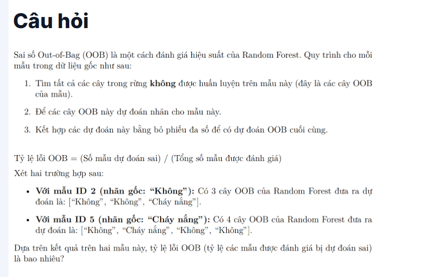
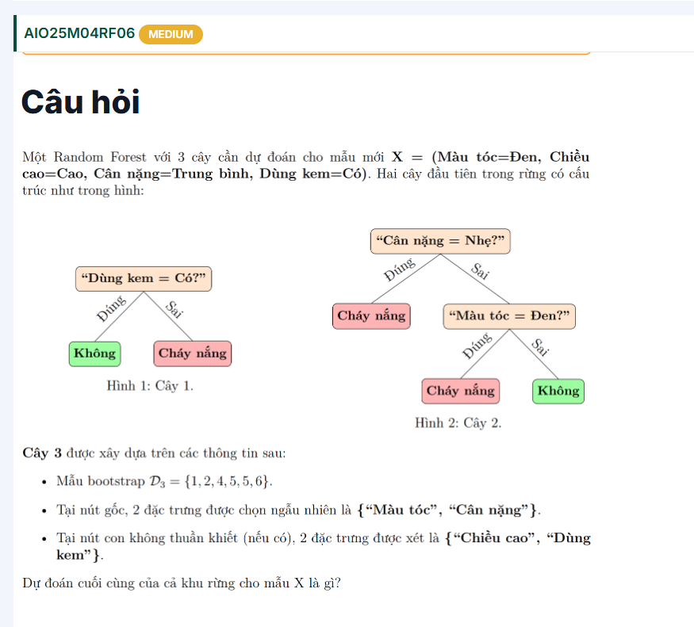

---

Ok, mình cùng giải chi tiết câu này nhé.

---

### 1. Tập bootstrap ( D_1 = )

→ tức là ta lấy 6 mẫu từ dữ liệu gốc theo bootstrap (có lặp).

Từ bảng dữ liệu gốc (ID 1–6):

| ID | Màu tóc | Chiều cao | Cân nặng  | Dùng kem | Kết quả   |
| -- | --------- | ---------- | ----------- | --------- | ----------- |
| 1  | Đen      | TB         | Nhẹ        | Không    | Cháy nắng |
| 2  | Đen      | Cao        | Trung bình | Có       | Không      |
| 3  | Rám      | Thấp      | Trung bình | Có       | Không      |
| 4  | Nâu      | Thấp      | Trung bình | Không    | Cháy nắng |
| 5  | Nâu      | TB         | Nặng       | Không    | Cháy nắng |
| 6  | Rám      | TB         | Nặng       | Có       | Không      |

Mẫu bootstrap ( D_1 ) gồm: 1, 2, 3, 3, 4, 5.

---

### 2. Phân bố nhãn trong ( D_1 )

* CN: ID 1,4,5 → 3 mẫu
* K: ID 2,3,3 → 3 mẫu

  → Tỉ lệ 50% - 50%.

Gini gốc:

[

G(S) = 1 - (0.5^2 + 0.5^2) = 0.5

]

---

### 3. Xét thuộc tính **“Màu tóc”**

Trong ( D_1 ):

* Đen: ID 1 (CN), ID 2 (K) → 2 mẫu (1–1) → Gini = 0.5
* Rám: ID 3,3 (K,K) → 2 mẫu (0–2) → Gini = 0
* Nâu: ID 4 (CN), ID 5 (CN) → 2 mẫu (2–0) → Gini = 0

Tính trung bình:

[

\sum \frac{|S_v|}{|S|} G(S_v) = \frac{2}{6}\cdot0.5 + \frac{2}{6}\cdot0 + \frac{2}{6}\cdot0 = 0.167

]

Gini Gain:

[

GG(S, \text{Màu tóc}) = 0.5 - 0.167 = 0.33

]

---

### 4. Xét thuộc tính **“Cân nặng”**

Trong ( D_1 ):

* Nhẹ: ID 1 (CN) → Gini = 0
* Trung bình: ID 2 (K), 3 (K), 3 (K), 4 (CN) → 4 mẫu (1–3)

  [

  G = 1 - \big(\left(\tfrac{1}{4}\right)^2 + \left(\tfrac{3}{4}\right)^2\big)

  = 1 - (0.0625 + 0.5625) = 0.375

  ]
* Nặng: ID 5 (CN) → Gini = 0

Tính trung bình:

[

\sum \frac{|S_v|}{|S|} G(S_v) = \frac{1}{6}\cdot0 + \frac{4}{6}\cdot0.375 + \frac{1}{6}\cdot0 = 0.25

]

Gini Gain:

[

GG(S, \text{Cân nặng}) = 0.5 - 0.25 = 0.25

]

---

### 5. Kết luận

* Gini Gain (Màu tóc) = **0.33**
* Gini Gain (Cân nặng) = **0.25**

👉 Giá trị lớn nhất = **0.33**

---

✅ Đáp án: **0.33**

Bạn có muốn mình viết luôn chi tiết cách làm tròn kết quả (2 chữ số thập phân như đề bài) không?

---

# Câu 3: 

Ta làm trên mẫu bootstrap (D_1={1,2,3,3,4,5}).

Sau khi chia ở gốc theo  **“Cân nặng = Trung bình?”** , nút con đang xét có tập:

[

S={2,3,3,4}

]

Nhãn: (K={2,3,3}) (3 mẫu), (CN={4}) (1 mẫu).

[

G(S)=1-\Big(\big(\tfrac{3}{4}\big)^2+\big(\tfrac{1}{4}\big)^2\Big)=1-\tfrac{10}{16}=\tfrac{6}{16}=0.375

]

Xét hai thuộc tính được phép:

### 1) “Màu tóc”

* Đen: {2} → K (thuần) → (G=0)
* Rám: {3,3} → K (thuần) → (G=0)
* Nâu: {4} → CN (thuần) → (G=0)

Trung bình có trọng số sau tách = 0 ⇒

[

GG(S,\text{Màu tóc}) = 0.375 - 0 = 0.375

]

### 2) “Dùng kem”

* Có: {2,3,3} → K (thuần) → (G=0)
* Không: {4} → CN (thuần) → (G=0)

⇒

[

GG(S,\text{Dùng kem}) = 0.375 - 0 = 0.375

]

**Kết luận:** Gini Gain lớn nhất tại nút này là **0.375** (làm tròn 2 chữ số:  **0.38** ).

---

# Câu 4: 

Kết quả là  **0.00** .

Giải nhanh:

* Từ gốc “ **Màu tóc = Đen?** ” → nhánh **sai** (≠ Đen) chứa {3,4,5,6}.
* Tách tiếp bằng “ **Dùng kem = Có?** ”:
  * Có → {3,6} → đều **Không** ⇒ Gini = 0.
  * Không → {4,5} → đều **Cháy nắng** ⇒ Gini = 0.

Mẫu **ID 4** nằm ở nhánh “Không” cùng ID 5, lá này thuần nhất ⇒  **Gini Impurity = 0** .

---

# Câu 5 

Kết quả:

* **ID 2** (nhãn thật  *Không* ): dự đoán OOB = [ *Không* ,  *Không* ,  *Cháy nắng* ] → đa số *Không* →  **đúng** .
* **ID 5** (nhãn thật  *Cháy nắng* ): dự đoán OOB = [ *Không* ,  *Cháy nắng* ,  *Không* ,  *Không* ] → đa số *Không* →  **sai** .

Tỉ lệ lỗi OOB (trên hai mẫu này) = số dự đoán sai / số mẫu đánh giá =  **1 / 2 = 0.50** .

---

# Câu 6: 

---

À, chuẩn rồi 👍 — trong đề là **bootstrap (D_3 = {1,2,4,5,5,6})** (ID 5 lặp lại 2 lần).

Mình sửa lại phân tích cho **Cây 3** nhé.

---

### 1. Tập bootstrap (D_3)

| ID | Màu tóc | Cân nặng | Nhãn |
| -- | --------- | ---------- | ----- |
| 1  | Đen      | Nhẹ       | CN    |
| 2  | Đen      | TB         | K     |
| 4  | Nâu      | TB         | CN    |
| 5  | Nâu      | Nặng      | CN    |
| 5  | Nâu      | Nặng      | CN    |
| 6  | Rám      | Nặng      | K     |

Đếm nhãn:

* CN = 4 (ID1, ID4, ID5, ID5)
* K = 2 (ID2, ID6)

---

### 2. Ở gốc: đặc trưng chọn ngẫu nhiên

#### Trường hợp chọn **Màu tóc**

* Đen: {1 (CN), 2 (K)} → không thuần
* Nâu: {4 (CN), 5,5 (CN,CN)} → thuần CN
* Rám: {6 (K)} → thuần K

Với X (Màu tóc = Đen, Cân nặng = TB, Dùng kem = Có):

→ rơi vào nhánh **Đen** (ID1,2).

* ID1: Không dùng kem, CN
* ID2: Có dùng kem, K

  → Nếu tiếp tục tách theo “Dùng kem”: với X (Có) →  **K** .

---

#### Trường hợp chọn **Cân nặng**

* Nhẹ: {1 (CN)} → thuần CN
* TB: {2 (K), 4 (CN)} → không thuần
* Nặng: {5,5 (CN,CN), 6 (K)} → không thuần

Với X (Cân nặng = TB):

→ rơi vào nhánh {2 (K), 4 (CN)}.

* ID2: Đen, K
* ID4: Nâu, CN

  → Nếu tiếp tục tách theo “Màu tóc”:

  * Đen → K
  * Nâu → CN

    → Với X (Đen) →  **K** .

---

### 3. Kết luận cho Cây 3

Dù chọn tách theo **Màu tóc** hay **Cân nặng** ở gốc, cuối cùng X vẫn được dự đoán  **K (Không)** .

---

### 4. Tổng hợp cả rừng

* Cây 1 → Không
* Cây 2 → Cháy nắng
* Cây 3 → Không

→ Bỏ phiếu: **Không = 2, Cháy nắng = 1**

✅  **Dự đoán cuối cùng = Không** .

---

Bạn có muốn mình vẽ lại **sơ đồ Cây 3** để thấy rõ cách X đi qua các nhánh không?
