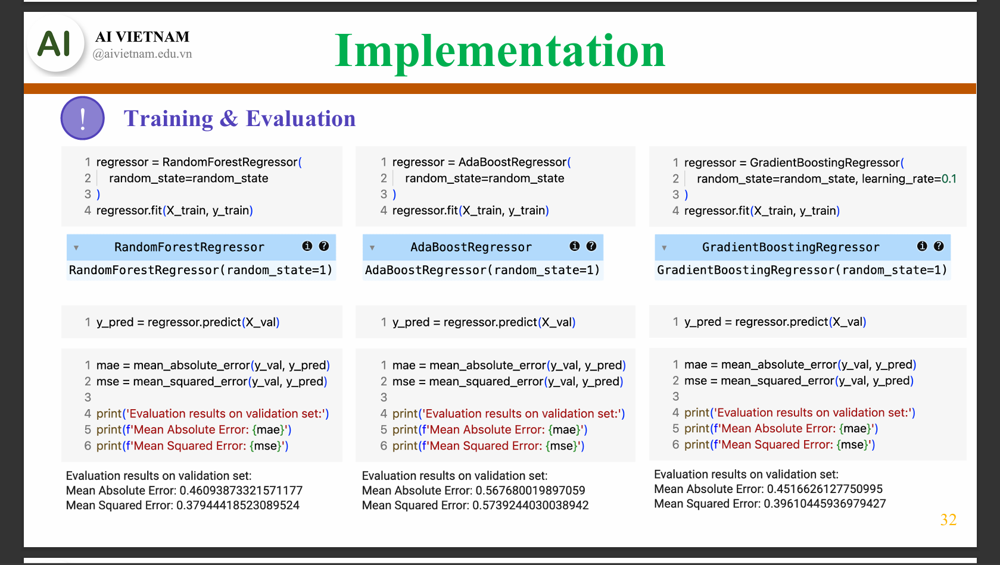
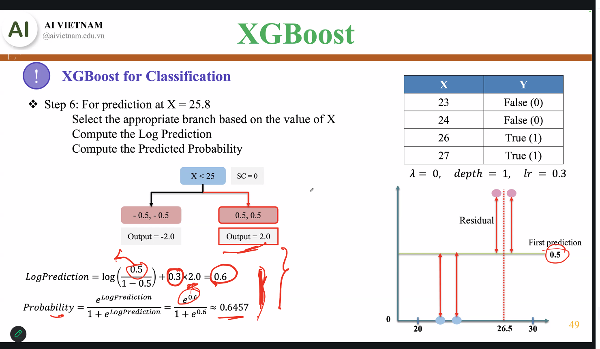
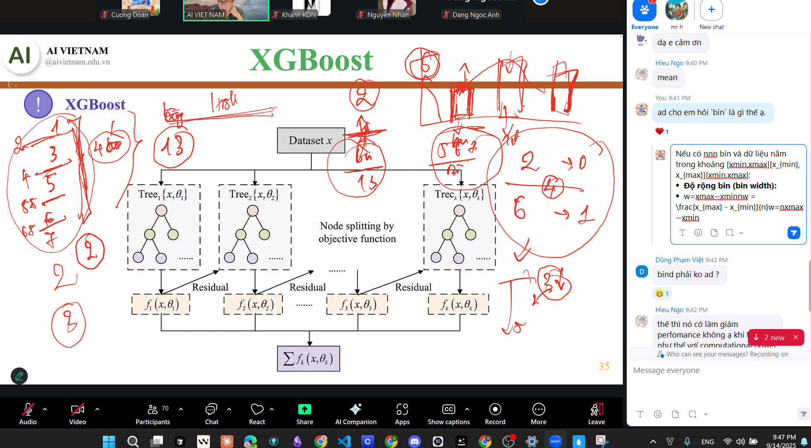

https://lms.aivietnam.edu.vn/api/files/683184ca519c0e157fb514cd/Documents%2F2025-8%2FM04W02%20-%20Gradient%20Boosting%2FAIO2025_GradientBoosting_v2.pdf

1. Tại sao dùng giá trị trung bình?
2. Residual Error?
3. 


Khởi tạo Gradient Boost tại giá trị trung bình vì tại đó lost bé nhất.

dSSR/d theta = - (...) Vì để lost giảm nên đạo hfn


---


```python
from sklearn.model_selection import TimeSeriesSplit, GridSearchCV
from sklearn.ensemble import GradientBoostingRegressor

# XGBoost
cv_split = TimeSeriesSplit(n_splits=4, test_size=100)
model = GradientBoostingRegressor()
parameters = {
    "max_features": [3, 4, 5],
    "learning_rate": [0.01, 0.05],
    "n_estimators": [100, 300]
}

grid_search = GridSearchCV(estimator=model, cv=cv_split, param_grid=parameters)
grid_search.fit(X_train, y_train)

```

---


---


---


```python

# Import Library
import numpy as np
import pandas as pd
from sklearn.datasets import load_breast_cancer
from sklearn.model_selection import train_test_split, GridSearchCV
from sklearn.ensemble import GradientBoostingClassifier
from sklearn.metrics import (
    accuracy_score,
    classification_report,
    confusion_matrix
)

# Load dataset
data = load_breast_cancer()
X = data.data
y = data.target

# Chuyển thành DataFrame để dễ quan sát
df = pd.DataFrame(X, columns=data.feature_names)
df['target'] = y
print(df.head())

# Split data to train/test (giữ tỷ lệ lớp bằng stratify)
X_train, X_test, y_train, y_test = train_test_split(
    X, y, test_size=0.2, random_state=42, stratify=y
)

print("\nSố lượng mẫu train:", X_train.shape[0])
print("Số lượng mẫu test:", X_test.shape[0])

# Khởi tạo mô hình cơ bản
gb = GradientBoostingClassifier(random_state=42)

# Lưới tham số
param_grid = {
    'n_estimators': [50, 100, 200],
    'learning_rate': [0.01, 0.05, 0.1],
    'max_depth': [2, 3, 4],
    'subsample': [0.8, 1.0]
}

# GridSearch với cross-validation = 5
grid_search = GridSearchCV(
    estimator=gb,
    param_grid=param_grid,
    cv=5,
    n_jobs=-1,
    scoring='accuracy',
    verbose=2
)

# Train GridSearch
grid_search.fit(X_train, y_train)

# Get model with best hyperparameter
print("Best parameters:", grid_search.best_params_)
print("Best cross-validation accuracy:", grid_search.best_score_)

best_gb = grid_search.best_estimator_

# Evaluate on test set
y_pred = best_gb.predict(X_test)

print("Test Accuracy:", accuracy_score(y_test, y_pred))
print("\nClassification Report:")
print(classification_report(y_test, y_pred, target_names=data.target_names))

```

---

# 14/09/2025

1. Hàm loss của nó?
2. Ví dụ:
3. init
   v

```
Cách khởi tạo learning rate?

Để ý learning rate mặc định của các thư viện

Khởi tạo learning rate theo các giải thuật đặc biệt?

```


- **Định nghĩa**: `n_estimators` đại diện cho số lượng cây quyết định (decision trees) mà mô hình sẽ tạo ra. Mỗi cây trong mô hình sẽ học từ một phần của dữ liệu và đóng góp vào dự đoán cuối cùng.
- `verbose=1`  tham số verbose nói chung trong CS thường mang ý nghĩa là thông tin chi tiết: thường dùng trong gỡ lỗi, giám sát, chi tiết thêm thông tin về 1 quá trình đang diễn ra nào đấy





Mình giải thích chi tiết hình XGBoost bạn gửi nhé:

---

## 1. Ngữ cảnh ví dụ

- Dữ liệu có 4 điểm:

  ```
  X   Y
  23  0
  24  0
  26  1
  27  1
  ```
- Tham số: λ=0\lambda = 0, độ sâu cây = 1 (stump), learning rate (η) = 0.3.

Mục tiêu: Dự đoán cho X=25.8X = 25.8.

---

## 2. Bước khởi tạo

- Trước tiên, XGBoost khởi tạo xác suất ban đầu cho tất cả mẫu bằng **tần suất lớp dương**.
- Ở đây có 2/4 mẫu thuộc lớp 1 → xác suất khởi tạo = 0.5.
- Log-odds khởi tạo:

  log⁡0.51−0.5=0\log\frac{0.5}{1-0.5} = 0

  → First prediction = 0 (logit).

---

## 3. Xây cây đầu tiên (depth = 1)

- Cây chia tại ngưỡng X<25X < 25.
- Nút trái: Output = -2.0 (cho các điểm 23, 24).
- Nút phải: Output = 2.0 (cho các điểm 26, 27).

Các output này thực chất đến từ việc tính gradient và hessian của loss trên residuals.

---

## 4. Dự đoán cho X=25.8X = 25.8

- Vì 25.8>2525.8 > 25 → đi nhánh phải → giá trị lá = +2.0.
- Với learning rate η = 0.3, giá trị cập nhật = 0.3×2.0=0.60.3 \times 2.0 = 0.6.
- Log prediction sau cập nhật:

  LogPrediction=0+0.6=0.6\text{LogPrediction} = 0 + 0.6 = 0.6

---

## 5. Chuyển logit → xác suất

- Xác suất dự đoán:

  P=e0.61+e0.6≈0.6457P = \frac{e^{0.6}}{1 + e^{0.6}} \approx 0.6457

---

## 6. Ý nghĩa

- Quy trình này minh hoạ cách XGBoost:

  1. Bắt đầu bằng log-odds từ phân bố lớp.
  2. Cập nhật log-odds bằng các cây nhỏ (weighted by learning rate).
  3. Biến đổi log-odds thành xác suất dự đoán qua sigmoid.

---

👉 Bạn có muốn mình viết lại ví dụ này dưới dạng **bảng từng bước (khởi tạo → chọn nhánh → cập nhật logit → xác suất)** để học viên dễ theo dõi hơn không?
-----------------------------------------------------------------------------------------------------------------------------------------------------------------------------------------

- [XGBoost Documentation — xgboost 0.4 documentation](https://xgboost-clone.readthedocs.io/en/latest/)
- 




Đúng rồi 👌, bạn hiểu chính xác:

Trong  **histogram** , **bin** là **khoảng giá trị (interval)** mà ta dùng để gom dữ liệu lại trước khi đếm tần suất.

---

## 1. Ví dụ

Giả sử có điểm số từ 0 đến 10:

* Nếu ta chọn bin width = 2 → các bin sẽ là:

  [0,2),[2,4),[4,6),[6,8),[8,10][0,2), [2,4), [4,6), [6,8), [8,10]
* Một học sinh có điểm 3.6 sẽ rơi vào bin  **[2,4)** .

---

## 2. Ý nghĩa

* **Bin nhỏ (width hẹp):** histogram chi tiết, dễ thấy biến động, nhưng dễ nhiễu.
* **Bin lớn (width rộng):** histogram mượt hơn, dễ thấy xu hướng, nhưng mất chi tiết.

---

## 3. Công thức tổng quát

Nếu có nn bin và dữ liệu nằm trong khoảng [xmin,xmax][x_{min}, x_{max}]:

* **Độ rộng bin (bin width):**

  w=xmax−xminnw = \frac{x_{max} - x_{min}}{n}
* Mỗi bin là [xmin+k⋅w,  xmin+(k+1)⋅w)[x_{min} + k \cdot w, \; x_{min} + (k+1) \cdot w) với k=0,1,…,n−1k = 0,1,\ldots,n-1.

---

## 4. Ứng dụng

* Trực quan hoá dữ liệu (EDA).
* Làm sạch hoặc biến đổi feature (binning trước khi train).
* Trong boosting (như LightGBM), histogram-based learning dùng “bin” để tăng tốc tìm split.

---

👉 Bạn có muốn mình viết thêm một **ví dụ bằng Python + matplotlib** để vẽ histogram và highlight các bin, để trực quan hơn không?
