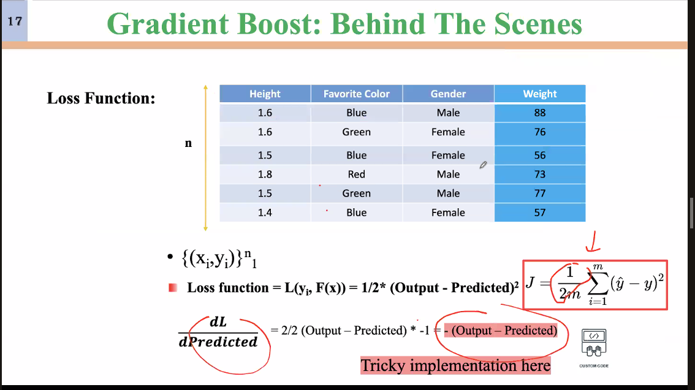
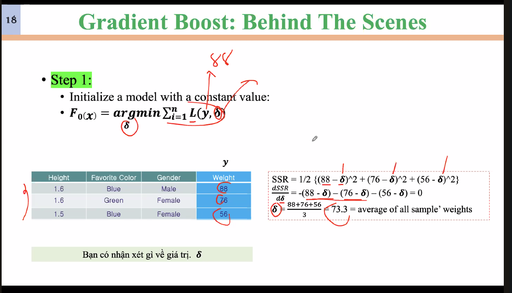
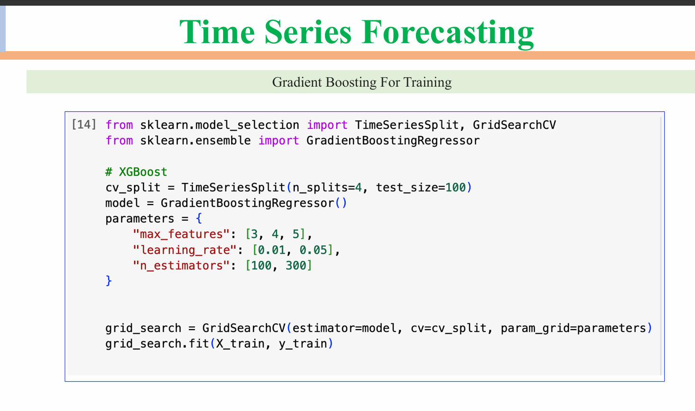
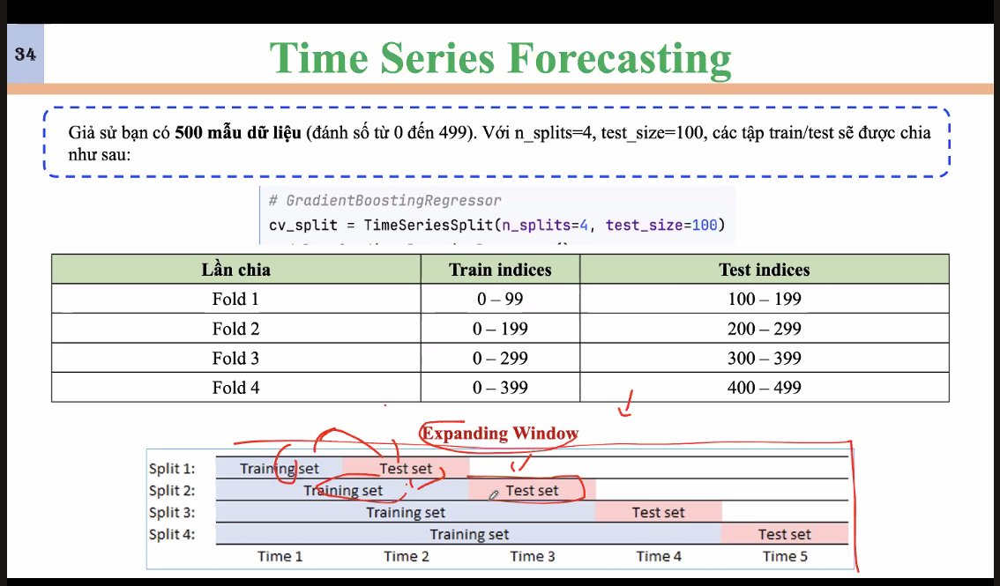
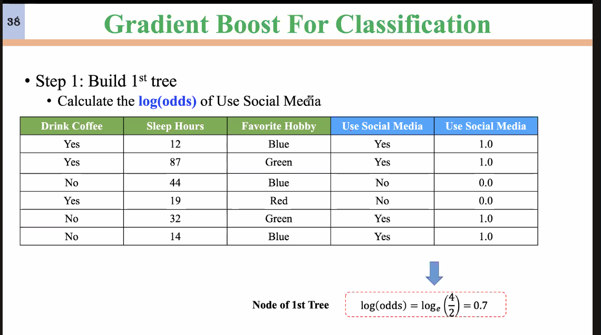
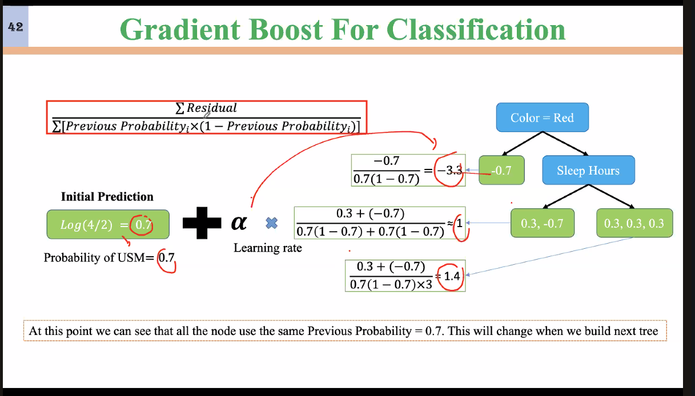
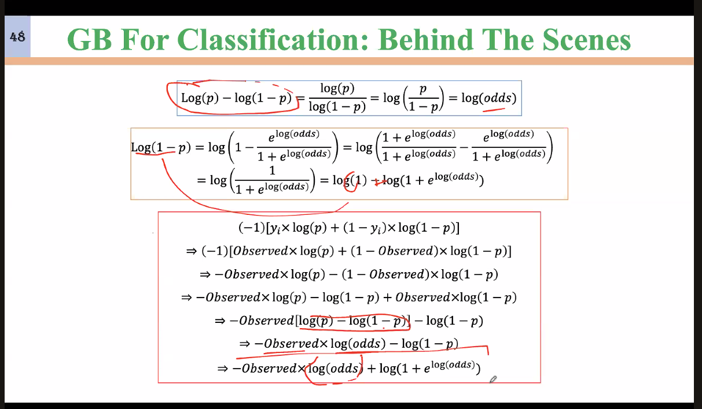
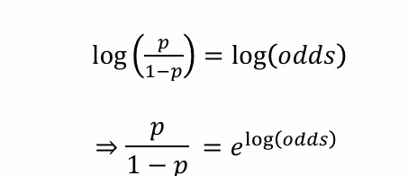
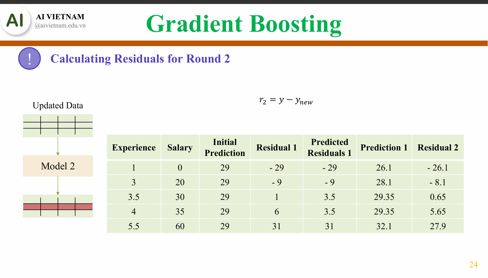
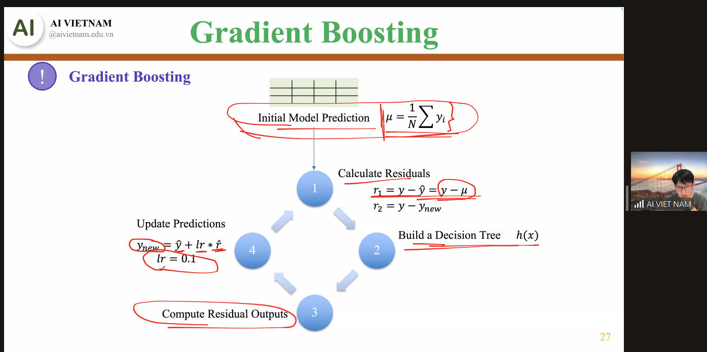

https://lms.aivietnam.edu.vn/api/files/683184ca519c0e157fb514cd/Documents%2F2025-8%2FM04W02%20-%20Gradient%20Boosting%2FAIO2025_GradientBoosting_v2.pdf

1. Tại sao dùng giá trị trung bình?
2. Residual Error?
3. 



Khởi tạo Gradient Boost tại giá trị trung bình vì tại đó lost bé nhất.

dSSR/d theta = - (...) Vì để lost giảm nên đạo hfn





---



```python
from sklearn.model_selection import TimeSeriesSplit, GridSearchCV
from sklearn.ensemble import GradientBoostingRegressor

# XGBoost
cv_split = TimeSeriesSplit(n_splits=4, test_size=100)
model = GradientBoostingRegressor()
parameters = {
    "max_features": [3, 4, 5],
    "learning_rate": [0.01, 0.05],
    "n_estimators": [100, 300]
}

grid_search = GridSearchCV(estimator=model, cv=cv_split, param_grid=parameters)
grid_search.fit(X_train, y_train)

```

---



---



---





```python

# Import Library
import numpy as np
import pandas as pd
from sklearn.datasets import load_breast_cancer
from sklearn.model_selection import train_test_split, GridSearchCV
from sklearn.ensemble import GradientBoostingClassifier
from sklearn.metrics import (
    accuracy_score,
    classification_report,
    confusion_matrix
)

# Load dataset
data = load_breast_cancer()
X = data.data
y = data.target

# Chuyển thành DataFrame để dễ quan sát
df = pd.DataFrame(X, columns=data.feature_names)
df['target'] = y
print(df.head())

# Split data to train/test (giữ tỷ lệ lớp bằng stratify)
X_train, X_test, y_train, y_test = train_test_split(
    X, y, test_size=0.2, random_state=42, stratify=y
)

print("\nSố lượng mẫu train:", X_train.shape[0])
print("Số lượng mẫu test:", X_test.shape[0])

# Khởi tạo mô hình cơ bản
gb = GradientBoostingClassifier(random_state=42)

# Lưới tham số
param_grid = {
    'n_estimators': [50, 100, 200],
    'learning_rate': [0.01, 0.05, 0.1],
    'max_depth': [2, 3, 4],
    'subsample': [0.8, 1.0]
}

# GridSearch với cross-validation = 5
grid_search = GridSearchCV(
    estimator=gb,
    param_grid=param_grid,
    cv=5,
    n_jobs=-1,
    scoring='accuracy',
    verbose=2
)

# Train GridSearch
grid_search.fit(X_train, y_train)

# Get model with best hyperparameter
print("Best parameters:", grid_search.best_params_)
print("Best cross-validation accuracy:", grid_search.best_score_)

best_gb = grid_search.best_estimator_

# Evaluate on test set
y_pred = best_gb.predict(X_test)

print("Test Accuracy:", accuracy_score(y_test, y_pred))
print("\nClassification Report:")
print(classification_report(y_test, y_pred, target_names=data.target_names))

```

---

# 14/09/2025

1. Hàm loss của nó?
2. Ví dụ:
3. init
   v

```
Cách khởi tạo learning rate?

Để ý learning rate mặc định của các thư viện

Khởi tạo learning rate theo các giải thuật đặc biệt?

```





- **Định nghĩa**: `n_estimators` đại diện cho số lượng cây quyết định (decision trees) mà mô hình sẽ tạo ra. Mỗi cây trong mô hình sẽ học từ một phần của dữ liệu và đóng góp vào dự đoán cuối cùng.
- `verbose=1`  tham số verbose nói chung trong CS thường mang ý nghĩa là thông tin chi tiết: thường dùng trong gỡ lỗi, giám sát, chi tiết thêm thông tin về 1 quá trình đang diễn ra nào đấy