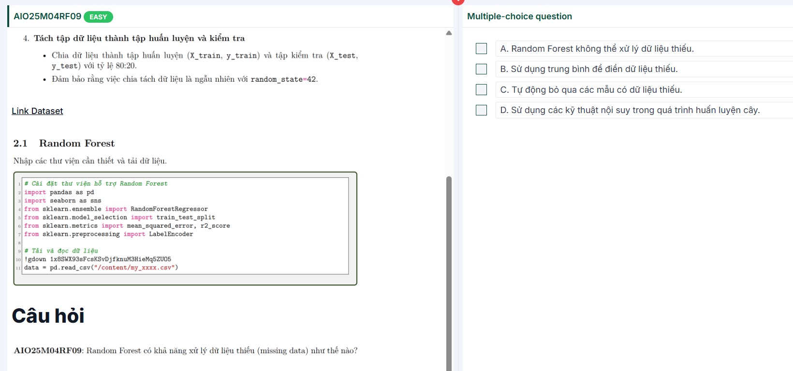

# Bagging 

Mình giải thích ngắn – dễ nhớ nhé.

# Bagging là gì (trong Random Forest)?

 **Bagging = Bootstrap Aggregating** . Ý tưởng: tạo **nhiều bộ dữ liệu con** bằng cách **lấy mẫu có hoàn lại (bootstrap)** từ dữ liệu gốc, huấn luyện **nhiều cây** độc lập trên các mẫu này, rồi  **gộp dự đoán** :

* Phân loại: lấy  **đa số phiếu** .
* Hồi quy: lấy  **trung bình** .

# Vì sao làm vậy?

* Các cây học từ những mẫu khác nhau → **ít tương quan** với nhau.
* Khi gộp lại,  **phương sai (variance) giảm mạnh** , dự đoán ổn định hơn → mô hình ít “quá khớp” hơn so với một cây đơn lẻ.

# Các bước bagging trong Random Forest

1. Lặp B lần (ví dụ 100 cây):
   * Lấy 1 mẫu bootstrap (cùng kích thước,  **có hoàn lại** ).
   * Huấn luyện một cây quyết định trên mẫu này.
   * (Đặc trưng RF còn **random feature** ở mỗi nút: chỉ xét k đặc trưng ngẫu nhiên khi tách – đôi khi gọi là  *feature bagging* .)
2. Khi dự đoán: cho điểm mới đi qua **tất cả** cây → gộp kết quả.

# Bonus: OOB (Out-of-Bag)

Vì lấy mẫu có hoàn lại, khoảng **~36%** điểm gốc **không xuất hiện** trong mỗi bootstrap. Ta dùng chính các điểm “bị bỏ quên” này để **đánh giá sai số OOB** – gần như một phép cross-validation “miễn phí”.

# So với boosting thì sao?

* **Bagging** : các cây  **độc lập** , gộp để  **giảm variance** .
* **Boosting** : các cây  **tuần tự** , cây sau sửa lỗi cây trước →  **giảm bias** , nhưng dễ quá khớp nếu không regularize.

---

Một câu check nhanh: theo bạn,  **bagging chủ yếu giảm bias hay giảm variance** ? (chọn một)

Nếu thích, mình làm luôn một ví dụ số nhỏ để bạn thấy rõ hiệu ứng gộp.

---

B. Đúng — Random Forest dùng bootstrap (mỗi cây huấn luyện trên một mẫu dữ liệu khác nhau) để tăng đa dạng.

C. Đúng — Ở mỗi nút chỉ xét một tập con đặc trưng ngẫu nhiên (feature bagging), tiếp tục tăng đa dạng giữa các cây.

Sao C lại đúng ?

---

C đúng vì đây chính là “feature bagging” – cơ chế cốt lõi thứ hai của Random Forest.

* Ở  **mỗi nút tách** , thay vì xét tất cả (p) đặc trưng, rừng chỉ **lấy ngẫu nhiên một tập con** (kích thước (m_\text{try})) để tìm split tốt nhất.
* Việc **giới hạn & ngẫu nhiên hoá đặc trưng** làm các cây ít dùng cùng một đặc trưng/split ⇒ **giảm tương quan giữa cây** ⇒ tăng **đa dạng** của rừng, giúp tổng hợp (bỏ phiếu/trung bình) giảm phương sai.

Một vài điểm cụ thể:

* Nếu có một đặc trưng “quá mạnh”, xét toàn bộ (p) đặc trưng sẽ khiến **mọi cây giống nhau** (đều chọn đặc trưng đó ở gần gốc). Giảm về (m_\text{try}) khiến đặc trưng mạnh  **đôi khi không được đưa vào danh sách xét** , buộc cây chọn hướng khác → đa dạng hơn.
* **Điều chỉnh (m_\text{try})** là nút chỉnh “đa dạng ↔ sức mạnh cây”:
  * (m_\text{try}) **nhỏ** →  **đa dạng↑** , tương quan↓ (nhưng mỗi cây yếu hơn chút).
  * (m_\text{try}) **lớn** → cây mạnh hơn, nhưng tương quan↑, đa dạng↓.
* Thực tế hay dùng:  **classification** : (m_\text{try}\approx \sqrt{p});  **regression** : (m_\text{try}\approx p/3) (chỉ là kinh nghiệm, có thể tune).

Lưu ý về câu chữ: “ **thay đổi số lượng đặc trưng tại mỗi nút** ” ở đây nên hiểu là **không xét toàn bộ đặc trưng** mà **chỉ xét một số lượng (mtry) nhỏ, được chọn ngẫu nhiên** ở  **mỗi nút** . Số lượng (m_\text{try}) có thể giữ **cố định** cho cả cây/rừng (chuẩn RF), nhưng  **tập đặc trưng được rút thăm thì thay đổi theo từng nút** , và chính điều đó tạo đa dạng.

---

Ok, nói “dễ nuốt” nè 😄

## Vì sao C đúng?

**C: “Thay vì xét tất cả đặc trưng, mỗi nút chỉ xét MỘT NHÓM ĐẶC TRƯNG NGẪU NHIÊN (mtry).”**

→ Đây gọi là **feature bagging** – mẹo chính của Random Forest để  **làm các cây khác nhau** .

### Hình dung đơn giản

* Nếu **xét tất cả đặc trưng** ở mọi nút, “đặc trưng mạnh nhất” sẽ **luôn** được chọn ở gần gốc → **các cây giống nhau** → dự đoán bỏ phiếu cũng… giống nhau ⇒  **ít đa dạng** .
* Khi **mỗi nút chỉ được bốc thăm vài đặc trưng** (ví dụ 2 trong tổng 10):
  * Nhiều nút **không thấy** đặc trưng mạnh nhất trong danh sách → buộc phải chọn đặc trưng khác.
  * Mỗi cây đi theo **nhánh khác nhau** → **đa dạng** ↑, **tương quan giữa cây** ↓ → gộp lại ( **đa số/trung bình** ) sẽ **ổn định hơn** (giảm variance).

### Ví dụ 10s

Giả sử có 5 đặc trưng: A (rất mạnh), B,C,D,E.

* Nếu xét **tất cả 5** ở gốc: cây nào cũng chọn **A** → cây na ná nhau.
* Nếu mỗi nút chỉ xét  **mtry = 2** : đôi khi gốc **không có A** trong danh sách → cây đó chọn B hoặc C… → rừng đa dạng.

### Ghi nhớ nhanh

* **mtry nhỏ** → đa dạng ↑ (mỗi cây yếu hơn chút, cả rừng ổn định hơn).
* **mtry lớn** → mỗi cây mạnh hơn nhưng giống nhau hơn (đa dạng ↓).
* Kinh nghiệm: phân loại dùng  **mtry ≈ √p** , hồi quy dùng **mtry ≈ p/3** (tune thêm tùy bài).

=> Nên C đúng, vì **giới hạn & rút thăm đặc trưng ở mỗi nút** chính là cách Random Forest tạo  **đa dạng giữa các cây** .

---

**B. 4 → 6 → 5 → 1 → 3 → 2.**

* **4** : Tạo N bootstrap từ dữ liệu gốc.
* **6** : Với mỗi bootstrap, xây một cây quyết định.
* **5** : Ở mỗi nút, chọn ngẫu nhiên k (ở đề là 2) đặc trưng ( *feature bagging* ).
* **1** : Tính Gini/Entropy để chọn split tốt nhất.
* **3** : (nếu theo quy trình đề bài) loại đặc trưng đã chọn trong nút đó.
* **2** : Lặp quá trình cho tới khi điều kiện dừng thỏa.

---

---

https://www.youtube.com/shorts/dpEO0RnrI38

---

**Đáp án đúng: D.**

**Vì sao?**

Về mặt thuật toán, rừng ngẫu nhiên (RF) là tập hợp các  **cây quyết định** . Nhiều biến thể cây xử lý thiếu ngay **trong quá trình xây cây** bằng các kỹ thuật nội suy/định tuyến, ví dụ:

* **Surrogate split (CART):** nếu tại một nút mẫu bị thiếu ở biến tách chính, cây dùng một biến “surrogate” (được học sẵn vì cho hướng rẽ gần giống) để quyết định đi trái/phải.
* **Phân luồng theo trọng số (C4.5):** khi gặp giá trị thiếu, mẫu được gửi xuống **cả hai nhánh** với trọng số theo phân bố dữ liệu đã biết; dự đoán là bỏ phiếu/trung bình  **có trọng số** .
* ( **RF-specific** ) **Proximity imputation:** tận dụng độ gần (mẫu cùng rơi vào các lá) để điền thiếu lặp bên trong quy trình huấn luyện.

=> Những cơ chế này là **xử lý nội tại** (nội suy/định tuyến) chứ không cần điền trước.

**Vì sao các phương án khác sai?**

* **A.** Sai: nói “không thể” là quá tuyệt đối. Thuật toán cây/RF *có* các cơ chế nội tại nêu trên.
* **B.** Sai: điền bằng trung bình là **tiền xử lý** (imputation ngoài mô hình), không phải khả năng nội tại của RF.
* **C.** Sai: RF/cây không “tự động bỏ qua” mẫu thiếu; nếu làm vậy vừa mất dữ liệu vừa sai bản chất.

Tóm lại, xét về  **cơ chế thuật toán** , phương án **D** là chính xác.

---

# Câu 34

**Câu hỏi (AIO25M04RF10):**

“So với các phương pháp ensemble khác như  **Gradient Boosting** , **Random Forest** thường có **ưu điểm** gì khi xử lý dữ liệu lớn và đa dạng?”

**Chọn đúng:** **A** và  **C** .

---

### A. *Random Forest khó bị overfitting hơn.* ✅

* **Đúng (thường đúng).** RF dùng **bagging** + **lấy mẫu đặc trưng ngẫu nhiên** → giảm **tương quan giữa cây** và  **giảm phương sai** , nên **ít overfit** hơn một cây đơn lẻ và thường **ổn định hơn** so với boosting (boosting dễ “đuổi theo” nhiễu nếu không regularize tốt).
* **Phản biện:** RF **không miễn nhiễm** overfit (ví dụ cây quá sâu, lá quá nhỏ, quá nhiều cây vẫn có thể khớp nhiễu).

### B. *Random Forest có thời gian huấn luyện nhanh hơn.* ❌

* **Sai/không luôn đúng.** RF **có thể** nhanh nếu  **chạy song song** , nhưng **không đảm bảo** nhanh hơn boosting về wall-clock. Boosting thường dùng **cây nông** và các thư viện tối ưu (XGBoost/LightGBM) nên **nhiều bài toán lớn lại nhanh hơn** RF.
* **Kết luận:** tốc độ  **phụ thuộc cấu hình & triển khai** , không phải ưu điểm cố hữu.

### C. *Random Forest có thể song song hóa dễ dàng hơn do các cây độc lập.* ✅

* **Đúng.** Các cây trong RF được huấn luyện **độc lập** trên  **bootstrap khác nhau** , nên có thể **phân luồng/đưa lên nhiều CPU/GPU** rất “dễ chịu” ( *embarrassingly parallel* ). Boosting thì **tuần tự** (cây sau phụ thuộc cây trước) nên **khó song song hóa** theo chiều cây.

### D. *Random Forest đạt được độ chính xác cao hơn trong mọi trường hợp.* ❌

* **Sai.** Không có mô hình nào thắng **mọi** bài toán. Trên dữ liệu bảng nhiều khi **Gradient Boosting** (đã regularize và tune) **vượt RF** về độ chính xác. ( *No Free Lunch* ).

**Tóm lại:** Ưu điểm điển hình của RF cho dữ liệu lớn/đa dạng là **độ ổn định, ít overfit hơn (A)** và  **dễ song song hóa (C)** ; **B** không bảo đảm, **D** chắc chắn sai.

---

# Câu 38 

**Đề bài (viết lại):**

*“Sự khác biệt cốt lõi giữa **AdaBoost** và **Gradient Boosting** trong cách chúng cải thiện mô hình qua các vòng lặp là gì?”*

Các lựa chọn:

A) AdaBoost nhấn mạnh sửa lỗi ở **những mẫu bị dự đoán sai** (mẫu “khó”), còn Gradient Boosting **giảm tổng loss** bằng cách dùng **đạo hàm** của hàm mất mát.

B) AdaBoost dùng mô hình con yếu, còn Gradient Boosting chỉ dùng mô hình con  **mạnh** .

C) AdaBoost **không thể** overfit, còn Gradient Boosting **dễ** overfit.

D) Hai phương pháp có **cùng** cách tiếp cận để cải thiện mô hình qua các bước lặp.

---

## Trả lời ngắn gọn

**Đáp án đúng: A.**

* **AdaBoost** : tăng trọng số cho **mẫu sai** để vòng sau học kỹ vào các điểm khó → sửa lỗi từng mẫu.
* **Gradient Boosting** : ở mỗi vòng fit theo **negative gradient** (pseudo-residual) của **tổng loss** → tối ưu hoá toàn cục theo hướng giảm loss.

---

## Giải thích chi tiết

### AdaBoost (phân loại, ý tưởng chính)

* Bắt đầu với trọng số mẫu  **đều nhau** .
* Ở vòng (m), train bộ học yếu (h_m) và tính **tỉ lệ lỗi có trọng số** (\varepsilon_m).
* Tính trọng số cây: (\alpha_m=\tfrac{1}{2}\ln\frac{1-\varepsilon_m}{\varepsilon_m}).
* **Tăng trọng số** các mẫu  **bị dự đoán sai** :

  [

  w_i^{(m+1)} \propto w_i^{(m)} \exp\big(\alpha_m \cdot \mathbb{1}[h_m(x_i)\ne y_i]\big)

  ]
* Tổ hợp dự đoán: (\mathrm{sign}!\left(\sum_m \alpha_m h_m(x)\right)).

  → Trọng tâm: **điển hình mẫu-centric** (tập trung vào “mẫu khó”).

> Với AdaBoost.R2 (hồi quy): cơ chế tương tự nhưng dùng sai số chuẩn hoá và (\beta=\varepsilon/(1-\varepsilon)), (\alpha=\ln(1/\beta)).

### Gradient Boosting (khung tối ưu hoá)

* Xem mô hình như hàm cộng dồn: (F_m(x)=F_{m-1}(x)+\eta\gamma_m h_m(x)).
* Ở vòng (m), tính **pseudo-residuals** (negative gradient):

  [

  r_{i,m}= -\frac{\partial \mathcal{L}(y_i, F(x_i))}{\partial F}\Big| *{F=F* {m-1}}

  ]
* Fit bộ học yếu (h_m) để xấp xỉ (r_{i,m}); tìm (\gamma_m) (line search) và cập nhật với **learning rate** (\eta).

  → Trọng tâm: **loss-centric** (giảm **tổng loss** bằng đạo hàm).

---

## Vì sao các phương án còn lại sai?

* **B – Sai.** Cả hai đều dùng **bộ học yếu** (thường là cây nông). Gradient Boosting **không yêu cầu** mô hình con mạnh.
* **C – Sai.** **Cả hai đều có thể overfit** nếu không regularize (quá nhiều vòng, depth lớn, (\eta) cao).
  * Khắc phục: giới hạn độ sâu, **shrinkage** ((\eta) nhỏ), **subsample** (Stochastic GB),  **early stopping** .
* **D – Sai.** Dù đều “boosting” nhiều vòng,  **cách cải thiện khác nhau** : AdaBoost  **reweight mẫu** ; Gradient Boosting  **theo gradient của loss** .

---

## Ghi nhớ nhanh

* **AdaBoost** = “ **đánh mạnh vào mẫu sai** ”.
* **Gradient Boosting** = “ **đi theo gradient để giảm tổng loss** ”.
* Cả hai: dùng  **bộ học yếu** , có thể overfit → cần regularization.
