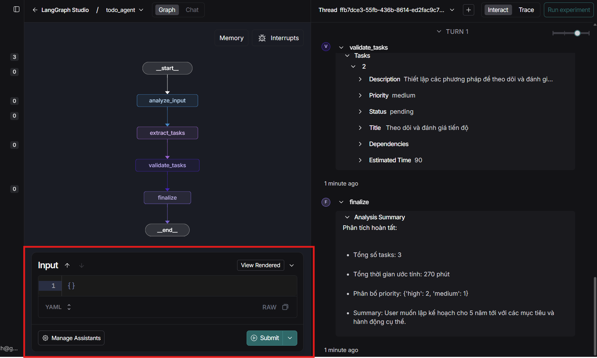
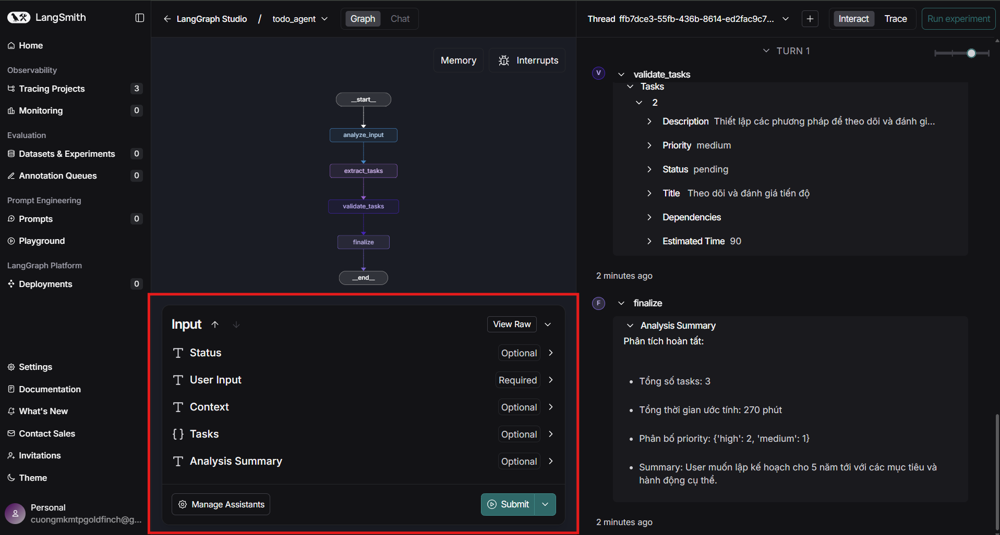

# 2 chế độ view trong Langgraph => Làm mình cứ tưởng do code lỗi nên đi fix trong code

Dựa vào phân tích hai hình ảnh, tôi có thể thấy sự khác biệt trong giao diện người dùng mà bạn mô tả:

## Phân tích UI State

**Hình 1 (Toàn bộ interface):**

- Hiển thị flowchart hoàn chỉnh với các bước: `analyze_input` → `extract_tasks` → `validate_tasks` → `finalize`
- Phần Input chỉ có một field JSON trống với `{}`
- Có các tùy chọn "YAML" và "RAW"
- Nút "View Rendered" và "Submit"

**Hình 2 (Close-up Input section):**

- Tập trung vào phần Input
- Vẫn chỉ hiển thị JSON input field trống
- Có option "View Rendered" được highlight

## Nguyên nhân UI thay đổi

Có vẻ như UI có **hai chế độ hiển thị**:

1. **RAW Mode** (như trong hình): Hiển thị input field JSON/YAML thuần túy
2. **Rendered Mode**: Có thể hiển thị các trường form cụ thể, rõ ràng hơn

**Cách chuyển đổi:**

- Nút **"View Rendered"** có thể là trigger để chuyển từ RAW mode sang form fields mode
- Khi có dữ liệu trong input field, UI có thể tự động parse và hiển thị các trường form tương ứng
- Tùy thuộc vào loại task hoặc schema được detect, UI sẽ render form fields phù hợp

**Khuyến nghị:**

- Thử click vào "View Rendered" để xem form fields
- Nhập một JSON sample vào input field để trigger việc hiển thị form
- Kiểm tra xem có các mode khác trong dropdown YAML không

Đây là thiết kế UI thông minh cho phép người dùng làm việc ở cả mức raw data và form interface thân thiện hơn.
