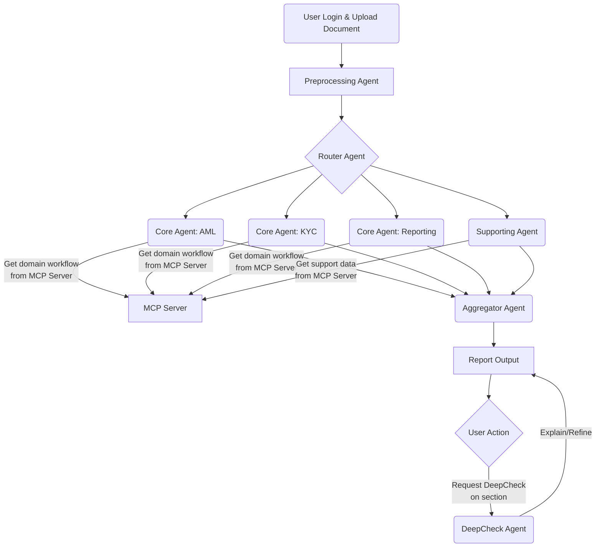

1. Deploy Langflow 
```bash
docker run -p 7860:7860 langflowai/langflow:latest

docker stop langflow && docker rm langflow

# Chạy lại với port 30001
docker run -d \
  -p 30001:7860 \
  -e LANGFLOW_HOST=0.0.0.0 \
  --name langflow \
  --restart unless-stopped \
  langflowai/langflow:latest
```

---
Bug: Lỗi là **401 (Unauthorized)** - nghĩa là Langflow đang yêu cầu authentication/login, nhưng người dùng chưa đăng nhập.

Lỗi chính:
- `Failed to load resource: the server responded with a status of 401 (Unauthorized)`
- Tất cả các API calls đều bị 401

### **Cách 1: Tắt Authentication (Đơn giản nhất)**

```bash
docker stop langflow && docker rm langflow

docker run -d \
  -p 30001:7860 \
  -e LANGFLOW_HOST=0.0.0.0 \
  -e LANGFLOW_AUTO_LOGIN=true \
  --name langflow \
  --restart unless-stopped \
  langflowai/langflow:latest
```

Biến `LANGFLOW_AUTO_LOGIN=true` sẽ **tự động login** không cần password.

### **Cách 2: Tạo tài khoản Admin**

```bash
docker stop langflow && docker rm langflow

docker run -d \
  -p 30001:7860 \
  -e LANGFLOW_HOST=0.0.0.0 \
  -e LANGFLOW_SUPERUSER=admin \
  -e LANGFLOW_SUPERUSER_PASSWORD=admin123 \
  --name langflow \
  --restart unless-stopped \
  langflowai/langflow:latest
```

Sau đó login với:

- Username: `admin`
- Password: `admin123`

---
# Perflexity 


