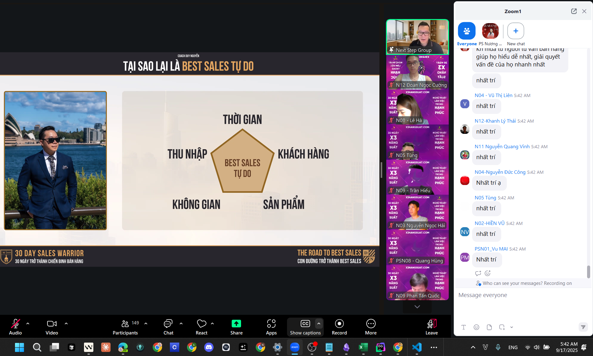

Link: [‌‬⁠‬‌⁠⁠⁠‌⁠‍‌‌‍‬⁠‍‌‬‬‌‍Untitled spreadsheet - Lark Docs](https://csg2ej4iz2hz.sg.larksuite.com/wiki/AkygwYS74iAcLlkdKpVle2hQgLe?table=tblAOat6jFwzamAK&view=vewjLSGFbM&sheet=3tynSB)

---

# 📅 DAILY KAIZEN LOG TEMPLATE

---

# 1. TIMELINE (THEO GIỜ)

| STT. Khung giờ   | Dự kiến | Thực tế | Kaizen |
| ----------------- | --------- | --------- | ------ |
| 1. 00h00 - 00h30  |           |           |        |
| 2. 00h30 - 01h00  |           |           |        |
| 3. 01h00 - 01h30  |           |           |        |
| 4. 01h30 - 02h00  |           |           |        |
| 5. 02h00 - 02h30  |           |           |        |
| 6. 02h30 - 03h00  |           |           |        |
| 7. 03h00 - 03h30  |           |           |        |
| 8. 03h30 - 04h00  |           |           |        |
| 9. 04h00 - 04h30  |           |           |        |
| 10. 04h30 - 05h00 |           |           |        |
| 11. 05h00 - 05h30 |           |           |        |
| 12. 05h30 - 06h00 |           |           |        |
| 13. 06h00 - 06h30 |           |           |        |
| 14. 06h30 - 07h00 |           |           |        |
| 15. 07h00 - 07h30 |           |           |        |
| 16. 07h30 - 08h00 |           |           |        |
| 17. 08h00 - 08h30 |           |           |        |
| 18. 08h30 - 09h00 |           |           |        |
| 19. 09h00 - 09h30 |           |           |        |
| 20. 09h30 - 10h00 |           |           |        |
| 21. 10h00 - 10h30 |           |           |        |
| 22. 10h30 - 11h00 |           |           |        |
| 23. 11h00 - 11h30 |           |           |        |
| 24. 11h30 - 12h00 |           |           |        |
| 1. 12h00 - 12h30  |           |           |        |
| 2. 12h30 - 13h00  |           |           |        |
| 3. 13h00 - 13h30  |           |           |        |
| 4. 13h30 - 14h00  |           |           |        |
| 5. 14h00 - 14h30  |           |           |        |
| 6. 14h30 - 15h00  |           |           |        |
| 7. 15h00 - 15h30  |           |           |        |
| 8. 15h30 - 16h00  |           |           |        |
| 9. 16h00 - 16h30  |           |           |        |
| 10. 16h30 - 17h00 |           |           |        |
| 11. 17h00 - 17h30 |           |           |        |
| 12. 17h30 - 18h00 |           |           |        |
| 13. 18h00 - 18h30 |           |           |        |
| 14. 18h30 - 19h00 |           |           |        |
| 15. 19h00 - 19h30 |           |           |        |
| 16. 19h30 - 20h00 |           |           |        |
| 17. 20h00 - 20h30 |           |           |        |
| 18. 20h30 - 21h00 |           |           |        |
| 19. 21h00 - 21h30 |           |           |        |
| 20. 21h30 - 22h00 |           |           |        |
| 21. 22h00 - 22h30 |           |           |        |
| 22. 22h30 - 23h00 |           |           |        |
| 23. 23h00 - 23h30 |           |           |        |
| 24. 23h30 - 24h00 |           |           |        |

---

Rất hay 👌 Mình sẽ format lại nguyên khung này thành một **template Markdown MINI PROBLEM SOLVING** rõ ràng, dễ điền và vẫn giữ nguyên tất cả keywords mà bạn đã có:

---

# 2. Phân loại trọng tâm

```
1. QUAN SÁT: Vấn đề/nỗi đau/cơ hội/việc tồn đọng => hệ quả?  
2. PHÂN TÍCH: Tô đậm việc hội tụ nhân duyên, sẽ giải quyết trong ngày hôm nay.
   
Ẩn ngầm bên trong: Tham - Si:
```

- 1. TRÒ CHƠI TÂM TRÍ
- 2. MỐI QUAN HỆ
- 3. SỰ NGHIỆP / TÀI CHÍNH
- 4. SỨC KHOẺ

---

## 10. Habit Tracking

👉 [https://habit.hdv.edu.vn/habits](https://habit.hdv.edu.vn/habits)

---

## 11. TIÊU ĐIỂM NGÀY

| CÔNG VIỆC, SỰ NGHIỆP, TÀI CHÍNH |          |      |          |     |          | 100% |
| ------------------------------------- | -------- | ---- | -------- | --- | -------- | ---- |
| KR1:                                  | Tracking | KR2: | Tracking | KR3 | Tracking |      |
|                                       |          |      |          |     |          |      |
|                                       |          |      |          |     |          |      |
|                                       |          |      |          |     |          |      |
|                                       |          |      |          |     |          |      |
| SUMMARY DAY                           |          |      |          |     |          |      |

| TÂM TRÍ, ĐÚC KẾT, LEVEL UP |          |      |          |     | 100%     | D |
| ------------------------------- | -------- | ---- | -------- | --- | -------- | - |
| KR1:                            | Tracking | KR2: | Tracking | KR3 | Tracking |   |
|                                 |          |      |          |     |          |   |
|                                 |          |      |          |     |          |   |
|                                 |          |      |          |     |          |   |
|                                 |          |      |          |     |          |   |
| SUMMARY DAY                     |          |      |          |     |          |   |

---

# 3. SỬ DỤNG TRONG NGÀY MINI PROBLEM SOLVING

---

## 3.1. 3O1T – OKRs

### ✅ Objective

- Objective cảm hứng và hướng mục tiêu dài hạn

### 🎯 Outcome

- Là _tác động_, _giá trị_ hoặc _thay đổi_ tạo ra nhờ các output
- 📊 **Metrics**: tập trung đo **outcome** để đảm bảo nỗ lực của bạn thực sự có giá trị
- **Why? – Đánh giá ưu tiên**

  - Mentor đánh giá?
  - Impact (Làm thì sao, không làm thì sao)
  - Time (có gấp không)
  - Risk (Tệ nhất là gì? giảm cái tệ đi được?)

### 📦 Output

- Là _sản phẩm_, _kết quả trực tiếp_ của công việc
- ✔ **Define to Done**: checklist
- Key Results 1, 2, 3 cụ thể, đo lường được

### 🧩 Tasks – 🧩 Actions

- …

---

## 3.2 REPORT

1. Vấn đề + Objective, Outcome, Metrics + Output – Key Results Output
2. Nguyên nhân + Dẫn chứng
3. Giải pháp + Dẫn chứng (Tasks, Actions)
4. Người khác recommend

---

## 3.3. STORY TELLING

- **Result (Hook):** Ở đây có ai muốn đạt được điều gì đó
- **Situation**
- **Think:** Nghĩ, cảm thấy (Feel), vì sao đặt câu hỏi phản biện (Nếu…) – 80-20
- **Action**
- **Results**
- **Call to action**

---

# 4. SUMMARY DAY

✅ …
⚠️ …
💡 …

# 5. Họp / Lớp học:

- Em làm ông nghệ thông tin ạTạm coi là thi thoảng bán kiến thức, kinh nghiệm, mối quan hệ ạ.
- Dùng tiếng khóc để bán cho người thân sự chú ý  ạ 😙
- Bán bản thân ạ :D
- Best sales xây dựng mqh nhanh và chất lượng


![[attachments/Pasted image 20250917052737.png]]

1. ...
2. Tự do về khách hàng
   Chọn mình bán cho ai và làm việc với ai
3. Tự do về sản phẩm
   - Bán hàng bằng giá trị, bán con người , tính cách, giá trị
1. Không gian : bạn giá trị chứ không bán sản phẩm 
2. Thu nhập 
- Ko cần thu nhập cứng luôn ạ. 

![[Pasted image 20250917054015.png]]



![[attachments/Pasted image 20250917054909.png]]
![[All/NOTE/1. DailyNote/attachments/Pasted image 20250917054936.png]]
---


---


...

