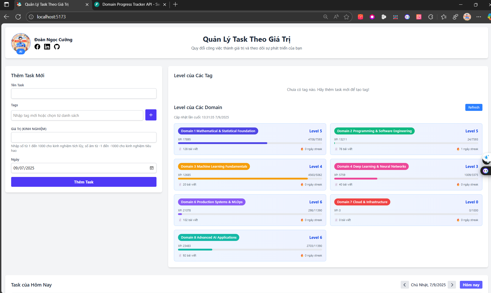
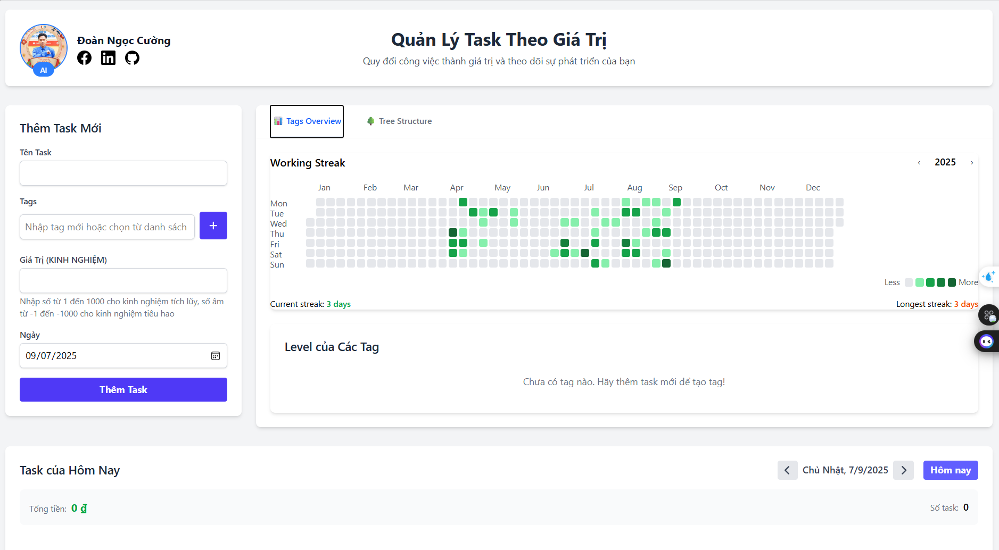

# Ver 1: Tháng 3/2025

# Ver 2: Tháng 9/2025:

## Ver 2.1: 07/09/2025

1. Mục tiêu là: làm sao dùng được AI trong Obsidant => đồng bộ github và cursor và dùng AI trong cursor (1 trick lỏ mà phải mất 12h mình mới nảy ra).
2. (Sau khi có AI invovle phần ghi chút) thì Mục tiêu tiếp là tìm cách đo lường được sự tiến bộ hàng ngày dễ dàng như việc đo lường chạy bộ.

- Sự tiến bộ này được thể hiện bằng gì? (bằng số lượng take note chất lượng trong thư mục) (Xây trước 1 lộ trình bằng việc sử dụng giáo trình của AIO - AI Việt Nam và Full Stack Data Science để vẽ ra lộ trình cho 1 AI Engneer.
- Hướng 1: Tự code 1 cái tracking đọc số lượng bài viết trong folder để đếm
  => Nảy ra việc kết hợp cái WEB 'TRACKING SỰ TÍCH LUỸ NGÀY XƯA ĐỂ TRIỂN KHAI'

Update để xem Global Streak: 

---
