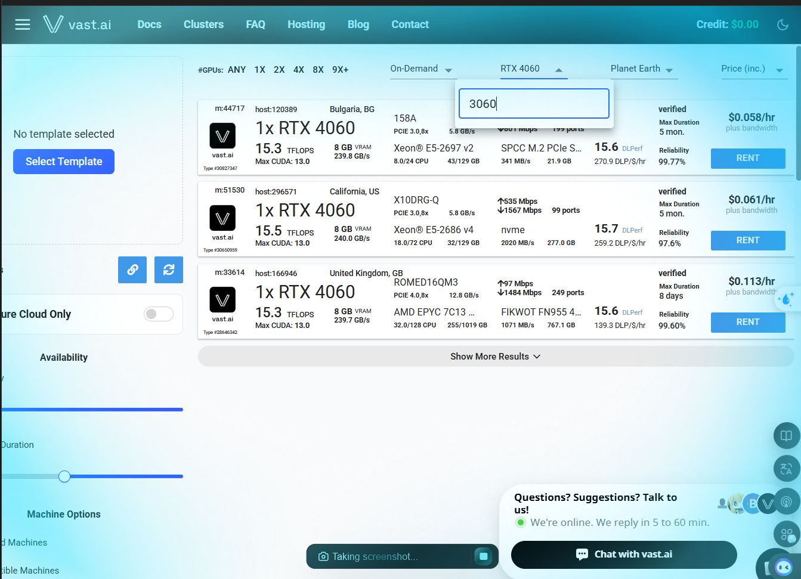

# Gợi ý thuê GPU rẻ cho hosting Embedding model

Ae dùng Cloud nhé! @Lê Thành Long em thử 2 con này nhé, có free trial cũng như giá rất rẻ để triển khai GPU.

## Tiêu chí chọn GPU

- GPU VRAM ≤ 8GB  
- Setup mỗi lần nhanh chóng  
- Dùng lúc nào tính tiền lúc đó (pay-as-you-go)  
- Giá rẻ, ổn định  

Chỉ cần 1 GPU khoảng 8GB VRAM là đủ dùng cho bài toán hosting embedding model.

---

## 1. RunPod (Khuyên dùng thử nghiệm)

- **Trang chủ**: [https://www.runpod.io/](https://www.runpod.io/)
- Rất phù hợp cho người mới bắt đầu vì giao diện cực kì thân thiện.
- Đặc biệt có **free trial $10** cho người dùng đăng ký mới.
- Triển GPU nhé anh em!

---

## 2. Vast.ai (Lựa chọn tiết kiệm chi phí)

- **Trang chủ**: [https://vast.ai/](https://vast.ai/)
- Mô hình chợ đen (marketplace) cho thuê GPU cá nhân, giá cực kì rẻ.

### Trang console chọn GPU trên Vast.ai:

- Lọc theo card: RTX 4060 (hoặc nhập “3060” để tìm RTX 3060).  
- Mode: On-Demand.  
- Có nhiều host khác nhau (Bulgaria, California, United Kingdom, …) với thông tin:
  - Số TFLOPS, băng thông PCIe  
  - Max CUDA version  
  - Loại CPU, RAM  
  - Tốc độ mạng, dung lượng/loại ổ đĩa (NVMe/SPCC M.2, …)  
  - Độ tin cậy (Reliability), số ngày tối đa cho phép chạy  
  - Giá theo giờ (ví dụ: $0.058/hr, $0.061/hr, $0.113/hr)  
- Nhấn nút **RENT** để thuê từng máy.

---

## Bảng gợi ý một số GPU rẻ

| # | Card        | VRAM | Giá/giờ  | Reliability | Location        | Ghi chú                     |
|---|-------------|------|---------:|------------:|-----------------|-----------------------------|
| 1 | RTX 3070    | 8 GB | $0.045/hr| 99.54%      | New York, US    | Rẻ nhất, ổn định nhất      |
| 2 | RTX 3060    | 12 GB| $0.045/hr| 99.53%      | South Korea     | 12GB nhưng cùng giá 8GB    |
| 3 | RTX 3060    | 12 GB| $0.052/hr| 99.48%      | British Columbia, CA | On-demand, verified |
| 4 | RTX 3070    | 8 GB | $0.053/hr| 95.88%      | Mexico          | Reliability thấp hơn       |
| 5 | RTX 3060 Ti | 8 GB | $0.053/hr| ~96%        | Mexico          | -                           |

> Chỉ cần chọn một GPU khoảng 8GB VRAM (hoặc 12GB nếu giá tương đương) là đủ dùng, ưu tiên các máy có Reliability trên 99% và giá khoảng $0.045/hr.

### Ảnh tham khảo thông số:

