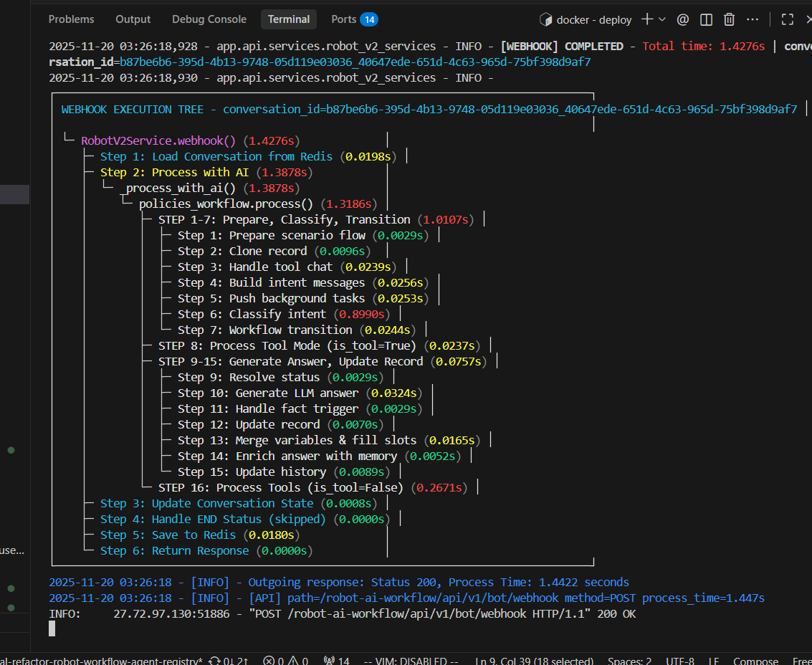
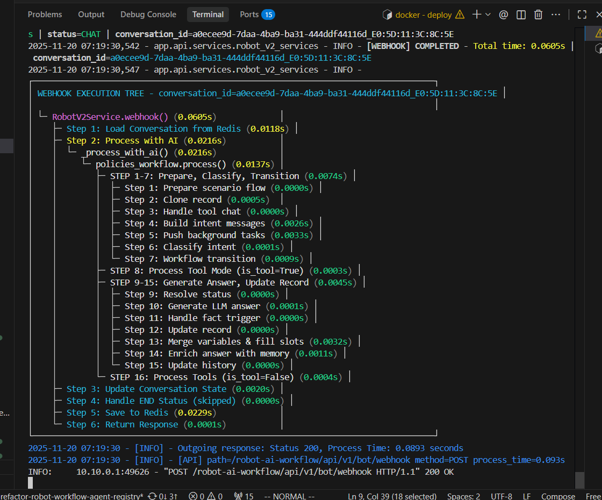
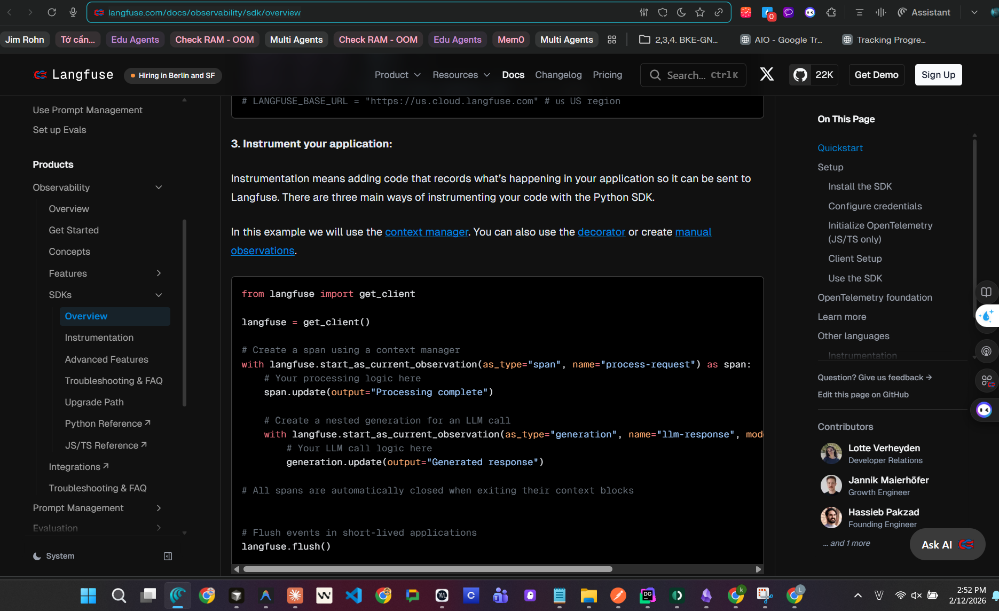

> Bài viết chia sẻ kinh nghiệm sử dụng Langfuse cho việc Tracing services trên Production, nếu có sai sót ở đâu mong được mọi người góp ý để mình có thể điều chỉnh. Mình đã trải qua gần 5 tháng (từ tháng 10, năm 2025 đến hiện tại 14/02/2026 để vừa đủ kiến thức, trải nghiệm để viết bài viết này).


Đôi lời giới thiệu:

1. Langfuse hỗ trợ cơ chế tracing cực tốt giúp theo dõi luồng data lồng nhau trên 1 UI rất trực quan, cộng với đo đạc hiệu năng p95, P99 đầy đủ => Đáp ứng đủ tiêu chí về: Log, Đo Đạc
    
2. Trong quá trình sử dụng, mình từng mắc phải những sai lầm khiến overhead lên đến 100ms-500ms, mình xin phép chia sẻ trong phần 1 này: "**Các sai lầm mình từng mắc phải khi sử dụng Langfuse"**
    
3. Sau này, khi có kinh nghiệm hơn, mình đã triển khai 1 service với response time < 150ms cho 100 CCU và mình dùng Langfuse để tracing. Mình nhận thấy 99% overhead ~ 10ms. Tuy nhiên 1% có những cú vút lên overhead lên đến 1s (so với bình thường chỉ 30ms), điều đó buộc mình đào sâu hơn cơ chế vận hành của Langfuse => Mình xin chia sẻ nó trong phần 2: **Vấn đề tranh chấp khoá và tranh chấp tài nguyên GIL. (Do cơ chế Langfusk SDK v3 hoàn toàn tương tự cách OpenTelemetry hoạt động, đều đẩy xuống 1 thread riêng: BatchSpanProcessor => gây ra vấn đề đề tranh chấp khoá và tranh chấp tài nguyên GIL)**

# Phần Mở Đầu: Đôi dòng về Langfuse

Langfuse là 1 nền tảng LLM Engineer mã nguồn mở được thiết kế đặc biệt để **observability toàn diện** cho các ứng dụng AI có sử dụng LLM (Large Language Models). 

Langfuse được xây dựng dựa trên chuẩn OpenTelemetry (1 observability framework và toolkit nổi tiếng), điều này giúp Langfuse tương thích rộng với các hệ thống. 

+, Observability dựa trên **3 trụ cột nền tảng (MELT)**

| Trụ cột     | Trả lời câu hỏi                    | Mô tả chi tiết                                                                                                                                                                                    | Ví dụ cụ thể                                                                                                                                                                          |
| ----------- | ---------------------------------- | ------------------------------------------------------------------------------------------------------------------------------------------------------------------------------------------------- | ------------------------------------------------------------------------------------------------------------------------------------------------------------------------------------- |
| **Metrics** | What? — Điều gì đang xảy ra?       | Các giá trị số được tổng hợp theo thời gian, dùng để theo dõi sức khỏe hệ thống, phát hiện bất thường và tạo alert. Thường là time-series, có thể aggregate theo service, endpoint, user, region. | Latency P95/P99, error rate, throughput (RPS/QPS), CPU/RAM/disk usage, số request timeout, số active users, queue length.                                                             |
| **Logs**    | Why? — Tại sao xảy ra?             | Các bản ghi sự kiện chi tiết theo thời gian, thường ở dạng text/JSON, mô tả những gì hệ thống đã làm. Dùng để debug, audit, điều tra nguyên nhân gốc (root cause).                                | Error stack trace, warning khi retry nhiều lần, thông tin input/output rút gọn, message “payment failed vì timeout tới bank API”, security logs (login failed, permission denied).    |
| **Traces**  | Where? — Xảy ra ở đâu trong luồng? | Chuỗi các span thể hiện đường đi của một request qua nhiều service, cho biết mỗi đoạn mất bao lâu và bottleneck nằm ở đâu. Dùng để hiểu kiến trúc phân tán và tối ưu end-to-end latency.          | Một request user → API Gateway → Service A → gọi Service B → truy vấn DB → gọi LLM, mỗi bước có start/end time, status, latency; nhìn vào trace thấy chậm ở Service B hoặc LLM call.  |

+, Với hệ thống AI/LLM, ngoài MELT cơ bản còn cần thêm các lớp sau:

| Thành phần                           | Mục đích chính                             | Mô tả chi tiết                                                                                                                                                                                                 | Ví dụ trong thực tế                                                                                                                                                                                                     |
| ------------------------------------ | ------------------------------------------ | -------------------------------------------------------------------------------------------------------------------------------------------------------------------------------------------------------------- | ----------------------------------------------------------------------------------------------------------------------------------------------------------------------------------------------------------------------- |
| **Prompt & Response Tracking**       | Hiểu model đang “nói gì” và tại sao        | Lưu toàn bộ input/output của LLM kèm metadata: model, phiên bản, temperature, top_p, system prompt, context được inject. <br>Đây là dạng **log đặc thù** cho LLM giúp replay, debug và audit.                  | Xem lại đúng prompt gây ra hallucination, so sánh output giữa GPT‑4.1 và Claude 3.7 với cùng 1 prompt, kiểm tra prompt nào vi phạm policy. [[splunk](https://www.splunk.com/en_us/blog/learn/opentelemetry.html)]​      |
| **Token Usage & Cost Tracking**      | Kiểm soát chi phí & tối ưu hiệu suất       | Ghi lại số token input/output, tổng token, và quy đổi ra chi phí theo từng request, user, endpoint, model, project. Cho phép phát hiện route/model nào “đốt tiền” nhất.                                        | Dashboard chi phí theo ngày, phát hiện 1 feature mới dùng context quá dài khiến cost tăng 3x; set alert khi chi phí 1 user vượt ngưỡng. [[dynatrace](https://www.dynatrace.com/news/blog/what-is-opentelemetry/)]​      |
| **Latency Breakdown**                | Tìm bottleneck trong pipeline              | Tách nhỏ thời gian xử lý thành: TTFT (Time to First Token), thời gian LLM generate, thời gian retrieval (vector DB), thời gian tool call, pre/post-processing. Giúp biết chính xác chậm ở đâu.                 | Thấy request tổng 8s: 2s ở retrieval, 5s chờ LLM, 1s post-process; quyết định đổi model nhanh hơn hoặc tối ưu embedding search. [[opentelemetry](https://opentelemetry.io/docs/what-is-opentelemetry/)]​                |
| **LLM Evaluation / Quality Scoring** | Đo “chất lượng” output, không chỉ kỹ thuật | Gán điểm cho câu trả lời theo tiêu chí: correctness, helpfulness, coherence, toxicity, relevance… bằng LLM-as-a-judge hoặc feedback user (thumbs up/down, rating). Dùng để theo dõi chất lượng theo thời gian. | A/B test hai prompt template, dùng LLM judge chấm điểm; log tỷ lệ hallucination theo từng version model; đo NPS cho chatbot support. [[ibm](https://www.ibm.com/think/topics/opentelemetry)]​                           |
| **Retrieval Analysis (RAG)**         | Đảm bảo model “đọc đúng tài liệu”          | Ghi lại các chunk được retrieve, điểm similarity, nguồn tài liệu, và đánh giá mức độ liên quan với câu hỏi. <br>Giúp phân biệt lỗi do retrieval kém hay do model trả lời sai.                                  | Phát hiện nhiều câu hỏi truy vấn nhầm collection, chunk retrieved không chứa keyword quan trọng; từ đó tune lại index, embedding, hoặc query. [[ibm](https://www.ibm.com/think/topics/opentelemetry)]​                  |
| **Guardrails & Security**            | Bảo vệ hệ thống & người dùng               | Theo dõi và gắn nhãn các input/output nguy hiểm: prompt injection, jailbreak, PII leak, hate/violence, NSFW… Có thể tự động chặn, mask, hoặc thay thế response.                                                | Log và block các prompt kiểu “ignore all previous instructions…”, phát hiện output chứa số tài khoản, địa chỉ nhà; gửi alert cho security team. [[splunk](https://www.splunk.com/en_us/blog/learn/opentelemetry.html)]​ |

```
Observability
├── 3 Pillars (Foundation)
│   ├── Metrics  → Alert & Dashboard
│   ├── Logs     → Debug & Audit
│   └── Traces   → Request Flow Visualization
│
└── LLM Extensions
    ├── Prompt/Response Tracking
    ├── Token & Cost Tracking
    ├── Latency (TTFT, E2E)
    ├── Evaluation (Hallucination, Quality)
    ├── Retrieval Analysis (RAG)
    └── Guardrails (Security)
```
# Phần 1. Các sai lầm mình từng mắc phải khi làm việc với Langfuse

## 1.1 SAI LẦM 1: Khởi tạo mới Langfuse mỗi lần dùng => Gây overhead 0.1s  (Khởi tạo trước Langfuse 1 lần các lần sau chỉ việc dùng giúp giảm response time xuống 0.002s - 0.01s)

### 1.1.1 Kiểm chứng độc lập

1. test_trace_no_create_langfuse_client.py

```python
import os
import time
from pathlib import Path
from dotenv import load_dotenv

# Load .env file from project root before importing langfuse
# Find project root (go up from app/common/langfuse to root)
current_dir = Path(__file__).parent
project_root = current_dir.parent.parent.parent
env_path = project_root / ".env"
load_dotenv(env_path)

from langfuse import observe

# @observe(name="test_trace_with_observe_no_create_langfuse_client")
def test_trace_with_observe():
    time.sleep(1)

def test_trace():
    time.sleep(1)

def __main__():
    start_time = time.time()
    test_trace_with_observe()
    end_time = time.time()
    duration_with_observe = end_time - start_time
    print(f"Duration with observe: {duration_with_observe:.6f} seconds")
    print("--------------------------------")
    start_time = time.time()
    test_trace()
    end_time = time.time()
    duration_without_observe = end_time - start_time
    print(f"Duration without observe: {duration_without_observe:.6f} seconds")
    print("--------------------------------")
    print(f"Difference: {duration_with_observe - duration_without_observe:.6f} seconds")

if __name__ == "__main__":
    __main__()
```

→ Overhead do observe (và ngầm tạo client) ≈ 1.683371 - 1.002006 ≈ 0.681s.

2. test_trace_create_langfuse_client_first.py

```python
import os
import time
from pathlib import Path
from dotenv import load_dotenv

# Load .env file from project root before importing langfuse
# Find project root (go up from app/common/langfuse to root)
current_dir = Path(__file__).parent
project_root = current_dir.parent.parent.parent
env_path = project_root / ".env"
load_dotenv(env_path)

# Import langfuse_client from app.common.langfuse module
# This client is already initialized in __init__.py at module level
# which is more efficient than creating a new client each time
import sys
sys.path.insert(0, str(project_root))
from app.common.langfuse import langfuse_client

# Now import observe - it will use the client from __init__.py
from langfuse import observe

# @observe(name="test_trace_create_langfuse_client_first")
def test_trace_create_langfuse_client_first():
    time.sleep(1)

def test_trace():
    time.sleep(1)

def __main__():
    start_time = time.time()
    test_trace_create_langfuse_client_first()
    end_time = time.time()
    duration_with_observe = end_time - start_time
    print(f"Duration with observe: {duration_with_observe:.6f} seconds")
    start_time = time.time()
    test_trace()
    end_time = time.time()
    duration_without_observe = end_time - start_time
    print(f"Duration without observe: {duration_without_observe:.6f} seconds")
    print(f"Difference: {duration_with_observe - duration_without_observe:.6f} seconds")

if __name__ == "__main__":
    __main__()
```

→ Overhead chỉ ≈ 1.002282 - 1.002002 ≈ 0.00028s (≈ 0.3ms), tức là nhỏ hơn trước đó khoảng 2–3 bậc.

=> Nguyên nhân lớn khiến ban đầu chậm là do không khởi tạo langfuse_client trước, để decorator tự lo client mỗi lần.

### 1.1.2 Các bài test thực tế từ Langfuse

### 1.1.3 Kiểm chứng thực tế : Mình đã tự kiểm nghiệm thực tế

### 1.1.4 Kết luận: 

```
Việc khởi tạo langfuse mỗi lần gây ra overhead lên đến 100ms-300ms
```

---

## 1.2. SAI LẦM 2: TRACE QUÁ NHIỀU NẤC KHÔNG CẦN THIẾT (nấc lồng nhau)

Chi tiết bên dưới:





> Nhìn vào 2 ảnh, hãy so sánh step 1, step 3 khi bật @observe và khi không bật => Ta thấy ngay bị overhead từ 3-10ms-300ms

### KẾT LUẬN: Kiểm tra các nấc lồng nhau ta đưa ra kết luận: 

```
1. Là trace ở hàm con được trace mỗi hàm dôi lên 0.002s - 0.01s 
2. Là việc trace ở hàm cha sẽ bị dôi 0.02s so với tổng của việc cộng time của các thành phần con (kể cả con được trace hay không được trace) 
```

## 1.3 SAI LẦM 3: Để capture_input=True, capture_output=True với JSON quá dài. 

```
1. Là trace ở hàm con được trace mỗi hàm dôi lên 0.002s - 0.01s 
2. Là việc trace ở hàm cha sẽ bị dôi 0.02s so với tổng của việc cộng time của các thành phần con (kể cả con được trace hay không được trace) 
3. Chỉ load data cần thiết bằng việc set: capture_input hoặc capture_output = False 
   +, Sau đó chỉ load data cần thiết vào metadata thông qua 
   @observe + update_current_trace, update_current_span, update_current_generation
   +, Mẹo: có thể dùng thêm orjson cho việc tối ưu xử lý JSON (đặc biệt hiệu quả với json dài)
```

### 1.3.1 Ví dụ: Trong `bot_services.webhook_service`

- Ở đầu hàm `webhook_service`, ta sẽ đặt capture_input=False, **ghi metadata theo conversation** => điều này giúp làm giảm kích thước của JSON load vào Queue và sau đó bắn lên Langfuse (nói cách khác: chỉ đính kèm những trường “nhẹ” nhưng đủ để debug (ID + message tóm tắt + thông tin audio), không nhét cả payload to vào trace để tránh overhead & xảy ra vấn đề GIL (vấn đề giữ thread vì phải parser JSON quá to))

```python
@observe(name="robot-v2.webhook-service", capture_input=False, capture_output=True)
async def webhook(self, payload: Dict[str, Any]) -> Dict[str, Any]:
...
if langfuse_client:
    metadata = {
        "conversation_id": conversation_id,
        "message": message[:200] if message else "",
        "has_audio_url": bool(audio_url),
        "audio_url": audio_url[:100] if audio_url else ""
    }
    langfuse_client.update_current_span(metadata=metadata)
```

### 1.3.2 Vậy làm sao để chỉ trace các thứ quan trọng. 

Chúng ta sử dụng các methods: update_current_trace, update_current_span, update_current_generation

|                | `update_current_trace`                    | `update_current_span`                        | `update_current_generation`              |
| -------------- | ----------------------------------------- | -------------------------------------------- | ---------------------------------------- |
| **Cấp**        | Trace (root)                              | Span/Observation (bước con)                  | Generation (LLM call trong span)         |
| **Hiển thị**   | Metadata của trace trên UI                | Metadata của span/observation                | Model, usage, cost trên Generation       |
| **Filter**     | Filter theo trace (vd: `conversation_id`) | Xem chi tiết từng bước                       | Xem cost, token theo từng LLM call       |
| **Vị trí gọi** | Thường ở entry point (API routes)         | Bên trong các hàm `@observe`                 | Trong LLM call (vd: OpenRouter client)   |
| **Ví dụ**      | `conversation_id`, `bot_id`, `user_id`    | `message`, `next_action`, `messages_summary` | `model`, `usage_details`, `cost_details` |
| **Cấu trúc**   | Trace (container gốc)                     | Trace → Span                                 | Trace → Span → Generation                |

```
Trace
  └── Span (intent.llm)
        └── Generation (LLM call)  → update_current_generation(...)
```

#### 1. `update_current_trace` — cập nhật metadata ở mức **trace** (cả request)

Dùng ở **route** (trước khi gọi service), vì lúc đó đang ở trace gốc:

**File:** `app/api/routes/bot_routes.py` (khoảng dòng 63–96)

```python
@router.post("/webhook")
# @observe(name="robot-v2.webhook-route", ...)
async def webhook(inputs: RobotV2Input, service: RobotV2Service = Depends(get_bot_service)):
    conversation_id = inputs.conversation_id
    user_id = inputs.user_id

    if conversation_id or user_id:
        try:
            langfuse = get_client()  # từ langfuse import get_client
            if langfuse:
                metadata = {}
                if conversation_id:
                    metadata["conversation_id"] = conversation_id
                if user_id:
                    metadata["user_id"] = user_id
                # Update trace metadata - hiển thị trên UI Langfuse
                langfuse.update_current_trace(metadata=metadata)
        except Exception as e:
            pass

    return await service.webhook(inputs.dict())
```

Tương tự cho `init_conversation`: cũng dùng `get_client()` rồi `langfuse.update_current_trace(metadata=...)` (với `conversation_id`, `bot_id`).

---

#### 2. `update_current_span` — cập nhật metadata cho **span** hiện tại (hàm được @observe)

Dùng **bên trong** các hàm đã được `@observe`, để gắn thêm thông tin cho đúng span đó.

**Ví dụ 1 – trong webhook service (span `robot-v2.webhook-service`):**  
**File:** `app/api/services/bot_services.py` (khoảng 1343–1354)

```python
@observe(name="robot-v2.webhook-service", capture_input=False, capture_output=True)
async def webhook(self, payload: Dict[str, Any]) -> Dict[str, Any]:
    # ...
    try:
        if langfuse_client:
            metadata = {
                "conversation_id": conversation_id,
                "message": message[:200] if message else "",
                "has_audio_url": bool(audio_url),
                "audio_url": audio_url[:100] if audio_url else ""
            }
            langfuse_client.update_current_span(metadata=metadata)
    except Exception:
        pass
```

**Ví dụ 2 – trong intent phoneme (span `robot-v2.intent.phoneme`):**  
**File:** `app/module/workflows/v2_robot_workflow/chatbot/policies/utils_conversation_workflow_orchestrator.py` (khoảng 333–341)

```python
@observe(name="robot-v2.intent.phoneme", capture_input=False, capture_output=True)
async def classify_by_phoneme(message: str, scenario: dict, next_action: int):
    try:
        if langfuse_client:
            langfuse_client.update_current_span(metadata={"message": message, "next_action": next_action})
    except Exception:
        pass
    return await RegexIntentClassifier().phoneme_classifier(...)
```

**Ví dụ 3 – trong intent LLM (span `robot-v2.intent.llm`):**  
Cùng file, khoảng 361–408:

```python
@observe(name="robot-v2.intent.llm", capture_input=False, capture_output=True)
async def classify_by_llm(messages: list, llm_base, params: dict, conversation_id: str, **kwargs) -> str:
    try:
        if langfuse_client:
            metadata = {
                "conversation_id": conversation_id,
                "messages_count": len(messages) if messages else 0,
                "model": params.get("model", "unknown") if params else "unknown",
                "provider_name": getattr(llm_base, 'provider_name', 'unknown'),
                # ... temperature, top_p, max_tokens, messages summary ...
            }
            langfuse_client.update_current_span(metadata=metadata)
    except Exception:
        pass
    return await llm_base.predict(messages=messages, params=params, ...)
```

---

#### 3. `update_current_generation` — cập nhật **generation** (LLM call: model, usage, cost)

Dùng khi bạn tự tạo/gọi LLM và muốn ghi lại model, token usage và cost lên generation hiện tại của Langfuse.

**File:** `app/common/openrouter_llm/client.py` (khoảng 269–277)

```python
# Update current generation; if none exists, this call is a no-op
self.langfuse_client.update_current_generation(
    model=plain_model,
    usage_details=usage_details,
    cost_details=cost_details,
)
```

Trước đó code đã build `usage_details` (input/output tokens) và `cost_details` (input/output/total cost). Đây là chỗ bổ sung metadata cho **generation** (một lần gọi LLM), không phải trace hay span chung.

---

## SAI LẦM 1.4: 12/02/2026 Sử dụng Langfuse() của version cũ mà không chịu update lên version mới sử dụng get_client()

> https://langfuse.com/changelog/2025-06-05-python-sdk-v3-generally-available

### So sánh: Phiên bản mới `get_client()` vs Phiên bản cũ`Langfuse()`

Đây là hai phương thức khởi tạo client của Langfuse Python SDK, với sự khác biệt quan trọng giữa các phiên bản SDK:


#### **1. Phiên bản SDK**

**`Langfuse()`**

- Sử dụng trong cả **SDK v2** (legacy) và **SDK v3** (hiện tại)
- Trong v2: Là phương thức chính để khởi tạo client
- Trong v3: Vẫn có thể dùng để tạo client instance mới với cấu hình tùy chỉnh

**`get_client()`**

- **Chỉ có trong SDK v3** (OpenTelemetry-based)
- Ra mắt từ tháng 6/2025 khi v3 trở thành Generally Available

[Langfuse](https://langfuse.com/changelog/2025-06-05-python-sdk-v3-generally-available)

https://langfuse.com/docs/observability/sdk/overview



**Quản lý instance**

| Đặc điểm     | `Langfuse()`                                                                                                                                                                                      | `get_client()`                                                                                                                                |
| ------------ | ------------------------------------------------------------------------------------------------------------------------------------------------------------------------------------------------- | --------------------------------------------------------------------------------------------------------------------------------------------- |
| **Pattern**  | Tạo instance mới mỗi lần gọi                                                                                                                                                                      | Singleton - trả về cùng 1 instance                                                                                                            |
| **Khởi tạo** | Multiple instances có thể tồn tại                                                                                                                                                                 | Chỉ 1 instance duy nhất (khởi tạo lần đầu)                                                                                                    |
| **Cấu hình** | Qua constructor parameters                                                                                                                                                                        | Qua environment variables                                                                                                                     |
| **Use case** | Cần nhiều client với cấu hình khác nhau                                                                                                                                                           | Sử dụng chung 1 cấu hình trong toàn app                                                                                                       |
|              | "If you create multiple Langfuse instances with the same public_key, the singleton instance is REUSED and new arguments are IGNORED."<br><br>https://langfuse.com/docs/observability/sdk/overview | - Tích hợp tốt với OpenTelemetry context propagation<br>- Tránh duplicate configuration<br>- Quản lý resource tốt hơn (singleton pattern)<br> |

###### OpenTelemetry Foundation

The foundation of the v3 SDK is OpenTelemetry, which brings several practical advantages:

- **Standardized Context Propagation**: OTEL automatically handles the propagation of trace and span context. This means when you create a new span or generation, it correctly nests under the currently active operation.
- **Third-Party Library Compatibility**: Libraries already instrumented with OpenTelemetry will integrate with the Langfuse SDK, with their spans being captured and correctly nested within your Langfuse traces.

---

#### **2. Code**

##### 2.1 Cách khởi tạo và cấu hình

**`Langfuse()`** - Khởi tạo instance mới

```python
from langfuse import Langfuse

# Cấu hình qua constructor
langfuse = Langfuse(
    public_key="your-public-key",
    secret_key="your-secret-key",
    base_url="https://cloud.langfuse.com",
    debug=True
)
```

**`get_client()`** - Truy cập singleton instance

```python
from langfuse import get_client

# Tự động sử dụng environment variables
langfuse = get_client()

# Environment variables cần thiết:
# LANGFUSE_PUBLIC_KEY="your-public-key"
# LANGFUSE_SECRET_KEY="your-secret-key"
# LANGFUSE_BASE_URL="https://cloud.langfuse.com"
```

```python
# Load environment variables và sử dụng

from dotenv import load_dotenv
from langfuse import get_client

# Load .env file vào environment variables
load_dotenv()

# get_client() sẽ tự động đọc từ env vars đã được load
langfuse = get_client()

# Sử dụng bình thường
@observe()
def my_function():
    # ...
    pass
```

Thông thường: Các dự án sẽ có 1 file config môi trường riêng - chuẩn best practices folder structure 

```
my_project/
├── .env                    # Environment variables
├── .env.example            # Template
├── config/
│   ├── __init__.py
│   └── settings.py         # ⭐ Config centralized
├── app/
│   ├── main.py
│   ├── api/
│   └── services/
└── requirements.txt
```

[Langfuse](https://langfuse.com/docs/observability/sdk/overview)

##### **2.2. Ví dụ sử dụng trong SDK v3**

**Sử dụng `get_client()` - Recommended approach**

```python
from langfuse import get_client, observe

# Module A
@observe()
def process_data():
    langfuse = get_client()  # Lấy global client
    langfuse.update_current_trace(tags=["processing"])
    # ... xử lý

# Module B
@observe()
def analyze_data():
    langfuse = get_client()  # Cùng 1 client instance
    langfuse.update_current_trace(user_id="user-123")
    # ... phân tích
```

**Sử dụng `Langfuse()` - Multiple clients**

```python
from langfuse import Langfuse

# Production client - sample 5% traces
langfuse_prod = Langfuse(
    sample_rate=0.05,
    public_key="prod-key"
)

# Beta client - sample 100% traces
langfuse_beta = Langfuse(
    sample_rate=1.0,
    public_key="beta-key"
)
```

#### 3. Recommend nên dùng: `get_client()` - BEST PRACTICE dù cả 2 đều singleton?

```
Lý do 1: INTENT RÕ RÀNG
─────────────────────────
  langfuse = get_client()       → "Tôi muốn LẤY client hiện có"  ✅ Rõ
  langfuse_client = Langfuse()  → "Tôi muốn TẠO client mới"      ❌ Misleading
                                   (thực tế không tạo mới)

Lý do 2: OVERHEAD NHỎ NHƯNG THẬT
──────────────────────────────────
  get_client()    → return _singleton          → ~0.001ms
  Langfuse()      → check key → lookup → return → ~0.01ms
                     ↑
                     10x chậm hơn (dù vẫn rất nhỏ)
                     × 1000 requests/s = 10ms/s unnecessary

Lý do 3: TRÁNH BẪY "NEW ARGUMENTS ARE IGNORED"
────────────────────────────────────────────────
  # File A (load trước)
  client = Langfuse(host="http://server-1:3009")     # Instance tạo

  # File B (load sau)  
  client = Langfuse(host="http://server-2:3009")     # ⚠️ BỊ IGNORED!
                                                       # Vẫn dùng server-1
  
  # Với get_client() → không ai bị lừa vì không pass args
```

---

## SAI LẦM 1.6: VẤN ĐỀ GIL CONTENTION

- Tình trạng: ĐANG P95, P99 30ms, tự nhiên có những khoảnh khắc bị vụt lên 1.5 s ???  
- NGUYÊN NHÂN GỐC ĐƯỢC TÌM THẤY: Do cơ chế auto-flush của Langfuse Python SDK v3 (OpenTelemetry BatchSpanProcessor) chạy trong cùng process với FastAPI/vLLM, gây GIL contention giữa background flush thread và asyncio event loop. Dùng `@observe` hay context manager đều đi qua cùng đường SDK này, nên bản chất overhead GIL **vẫn tồn tại**, chỉ khác là mỗi pattern làm tần suất flush và số spans khác nhau.

- Mình sẽ có 1 bài viết riêng cho phần này : P2 - Langfuse

---

